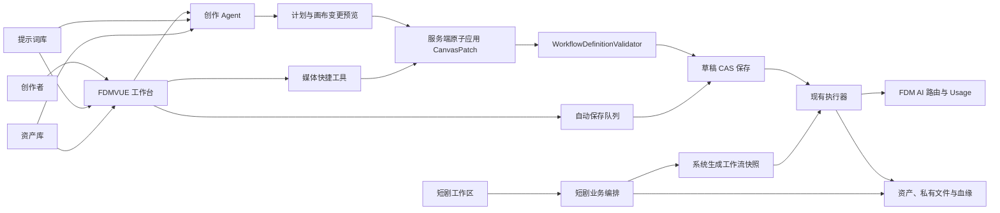

# FDM 智能创作参考 VOZEB 的五阶段改造 TODO

- 文档状态：`自动化实施完成 / P5C（P0 ～ P5C 已完成；P5A → P5B → P5C 数据库迁移已于 2026-08-20 执行并复核；真实供应商、FFmpeg 与浏览器部署验收待执行）`
- 适用日期：2026-08-18
- 主系统后端：`C:\Users\Administrator\Desktop\Project\FDMServer`
- 主系统前端：`C:\Users\Administrator\Desktop\Project\FDMVUE`
- 基线设计：`FDMVUE/docs/design/fdmcreative-workbench-design-v2.md`
- 实施原则：保留 FDM 的强类型 DAG、权限、模型路由、执行器、资产血缘和版本体系；只借鉴 VOZEB 的产品能力与交互，不复制 VOZEB 源码、素材或 AGPL 代码。

> 给 Terra：请先完整阅读本文，再按 `P0 → P1 → P2 → P3 → P4 → P5` 顺序执行。只有阶段退出门禁全部通过，才允许勾选该阶段并进入下一阶段。不要跳过后端校验、数据库迁移、权限测试或失败恢复测试。

## 0. 最终目标与明确决策

### 0.1 最终产品形态

将当前 `/fdmcreative/workbench/:projectId` 从专业节点编辑器升级为“Agent 辅助、自动保存、媒体快捷编辑、音频生产、短剧生产”的企业级 AI 创作平台，同时保持下面这些现有能力不退化：

- 强类型输入/输出端口。
- DAG、自环、重复连线、必填输入、单值输入校验。
- `FULL / NODE / DOWNSTREAM` 三种执行范围。
- 图片/视频循环在运行前展开，不允许用户画布出现真实环路。
- FDM AI 逻辑模型、租户策略、调用记录、用量、配额与供应商路由。
- 项目 `OWNER / EDITOR / RUNNER / VIEWER` 权限及 `super_admin` 跨项目管理。
- 私有文件、资产生命周期、素材血缘、跨项目安全复制。
- 草稿乐观锁、不可变发布版本、执行快照、SSE、失败重试与恢复。

### 0.2 五个产品阶段

- [x] `P1`：Agent 化工作台。
- [x] `P2`：自动保存、冲突恢复和工作流导入导出。
- [x] `P3`：画布内媒体快捷工具、结果版本栈和采用版本。
- [x] `P4`：音频节点族与音视频处理闭环。
- [x] `P5`：独立短剧生产模块。

### 0.3 本方案明确不做

- [ ] 不修改、不接入、不恢复已弃用的 Infinite-Canvas 项目。
- [ ] 不修改 `FdmTool` 浏览器扩展，除非以后有独立需求。
- [ ] 不把 VOZEB-PRO 作为 iframe、微前端或第二套后台嵌入 FDM。
- [ ] 不复制 VOZEB-PRO 的 React/Next.js/AGPL 源码、图片、样式或数据库实现。
- [ ] 不新建第二套用户、租户、登录、模型渠道、积分、Usage、素材库或提示词库。
- [ ] 不让前端直连任何模型供应商。
- [ ] 不在工作流 JSON、Agent 消息或短剧数据中持久化 API Key、Token、供应商任务号、Base64、Blob、本地路径或临时签名 URL。
- [ ] 不用自动合并掩盖多人编辑冲突；第一版冲突必须显式处理。

## 1. Terra 执行协议

### 1.1 每次开始工作前

- [x] 在 `FDMServer` 执行 `git status --short --branch`，记录并保护用户已有改动。
- [x] 在 `FDMVUE` 执行 `git status --short --branch`，记录并保护用户已有改动。
- [x] 不重置、不清理、不覆盖不属于当前阶段的修改。
- [x] 如待修改文件已有用户改动，先阅读 diff；只有能安全合并时继续，否则报告具体冲突。
- [x] 先运行当前阶段要求的基线测试，确认失败不是新改动引入。
- [x] 检查计划使用的 SQL 补丁文件名尚未存在；已经执行过的历史补丁只能新增后续补丁，不能回改。

### 1.2 每个阶段的交付规则

- [ ] 后端、前端、SQL、测试和文档作为一个完整能力交付，不能只做页面假数据。
- [ ] 每完成一个可独立回滚的子任务，执行相关最小测试。
- [ ] 阶段结束时执行本阶段全量测试和构建门禁。
- [ ] 只有代码、测试、迁移和验收证据齐全后，才能把对应 TODO 改为 `[x]`。
- [ ] 不自动 `push`；只有用户明确要求后才能推送。
- [ ] 提交建议按阶段拆分，提交信息使用现有风格，例如 `feat(fdmcreative): add canvas agent planning`。

### 1.3 强制停止条件

- [ ] 发现需要删除、重建或不可逆迁移现有生产数据时停止并报告。
- [ ] 发现实际供应商不支持计划中的模型能力时，不伪造成功；保留能力检测、禁用状态和清晰说明。
- [ ] 发现需要绕过 `ProjectAccessService`、`WorkflowDefinitionValidator`、FDM AI 或 `FileApi` 才能实现时停止并重新设计。
- [ ] 发现 Agent 或导入流程可能静默覆盖更高 `draftVersion` 时停止并修正。
- [ ] 发现跨租户、跨项目素材 ID 可直接引用时停止并修正。
- [ ] 发现需要复制 VOZEB AGPL 源码时停止；只能独立实现同类功能。

## 2. 现有能力基线与必须复用的代码

### 2.1 后端基线

- [ ] 草稿读取、CAS 保存和发布：`yudao-module-fdmcreative/.../CreativeWorkflowServiceImpl.java`。
- [ ] 草稿请求必须继续携带 `expectedDraftVersion`：`WorkflowDraftSaveReqVO.java`。
- [ ] 结构和执行校验：`domain/validator/WorkflowDefinitionValidator.java`。
- [ ] 端口兼容：`domain/validator/PortCompatibilityMatrix.java`。
- [ ] 项目角色和超级管理员：`service/ProjectAccessService.java`。
- [ ] 执行快照、循环展开、并发槽、节点任务、重试和恢复：`service/CreativeExecutionServiceImpl.java`。
- [ ] 执行 SSE：`service/event/CreativeExecutionEventStream.java`。
- [ ] 模型提交必须经过：`service/ai/FdmAiCreativeGateway.java` 和 `FdmAiInvocationApi`。
- [ ] 私有产物归档和血缘：`service/CreativeArtifactService.java`。
- [ ] 资产库：`CreativeAssetController / Service`。
- [ ] 提示词库：`CreativePromptController / Service`。
- [ ] 新 SQL 使用 `sql/mysql/patches/` 下可重复执行、只前进的补丁风格。

### 2.2 前端基线

- [ ] 工作台容器：`apps/web-antd/src/views/fdmcreative/workbench/editor/index.vue`。
- [ ] X6 适配器、历史、快捷连线和序列化：`editor/graph/graph-adapter.ts`。
- [ ] 32 类节点注册表：`editor/graph/catalog.ts`。
- [ ] 节点编辑：`editor/components/NodeInlineEditor.vue`。
- [ ] 节点显示：`editor/components/WorkbenchNode.vue`。
- [ ] 执行任务面板：`editor/components/ExecutionTaskPanel.vue`。
- [ ] 可恢复 SSE 客户端：`editor/execution-event-stream.ts` 和 `use-execution-event-stream.ts`。
- [ ] 资产选择器：`fdmcreative/shared/AssetLibraryPicker.vue`。
- [ ] 提示词选择器：`fdmcreative/shared/PromptLibraryPicker.vue`。
- [ ] API：`apps/web-antd/src/api/fdmcreative/index.ts`。

### 2.3 基线验证

- [x] 记录当前后端 `yudao-module-fdmcreative` 测试结果。
- [x] 记录当前前端 fdmcreative Vitest 结果。
- [x] 记录当前前端 `typecheck:fdmcreative` 结果。
- [x] 保存至少一个包含图片、视频、随机提示词、循环、集合和输出节点的回归工作流 JSON，仅用于测试夹具，不包含真实私有 URL。
- [x] 建立权限测试账号矩阵：OWNER、EDITOR、RUNNER、VIEWER、super_admin、无项目权限用户。

## 3. 目标架构



### 3.1 数据真相来源

- [ ] 项目和成员真相：`fdmcreative_project / fdmcreative_project_member`。
- [ ] 工作流真相：当前草稿 JSON、`draftVersion` 和不可变 `workflow_revision`。
- [ ] 运行真相：`execution_run / node_run / node_run_attempt / execution_event`。
- [ ] 模型调用真相：FDM AI invocation 和 `/fdmai/usage`。
- [ ] 素材真相：`fdmcreative_asset / artifact_lineage` 和 Infra 私有文件。
- [ ] Agent 对话真相：新增 Agent conversation/message/run/event 表。
- [ ] 短剧业务真相：新增短剧脚本、实体、镜头和合成版本表；画布仅作为可检查的执行表达，不反向覆盖短剧业务数据。

### 3.2 全局安全与一致性约束

- [ ] 所有 ID 由服务端校验租户和项目归属。
- [ ] VIEWER 只能读取；RUNNER 只能运行；EDITOR/OWNER 可编辑；super_admin 可跨项目读取、编辑和运行，但分享权限继续遵循现有策略。
- [ ] Agent 应用画布要求 `EDIT`，Agent 触发执行要求 `RUN`，两者不能混为一个权限检查。
- [ ] Agent、媒体工具、短剧生成的工作流都必须执行同一 `WorkflowDefinitionNormalizer + WorkflowDefinitionValidator`。
- [ ] 所有模型请求都使用 `FdmAiInvocationSubmitReqDTO`，业务 ID、幂等键、routeKey 和 capability 必须明确。
- [ ] 所有模型输出先归档为 FDM 私有资产，再暴露给下游节点和 UI。
- [ ] 所有异步状态可刷新恢复，浏览器关闭不能造成重复提交模型。
- [ ] 所有长列表使用分页或游标，不能首屏加载完整消息、素材、节点历史或短剧全部版本。
- [ ] 所有富文本/Markdown 展示必须转义或安全渲染，禁止把模型输出直接交给 `v-html`。

## 4. P0：实施前置与公共基础

> 目的：只建立公共契约和测试基础，不改变产品使用方式。P0 完成后才能进入 P1。

### 4.1 架构与契约

- [x] `P0-01` 确认所有新增类继续放在 `yudao-module-fdmcreative`，只依赖 `yudao-module-fdmai-api`，不依赖 fdmai provider/biz 实现。
- [x] `P0-02` 为 Agent、自动保存、媒体工具、音频、短剧分别建立功能开关，默认值和生产启用方式写入 `CreativeProperties` 与 README。
- [x] `P0-03` 定义统一业务来源枚举：`WORKBENCH`、`AGENT`、`MEDIA_TOOL`、`DRAMA_SHOT`、`DRAMA_COMPOSE`；只保存业务语义，不保存供应商信息。
- [x] `P0-04` 为新增接口统一错误码段，至少覆盖：上下文过大、Agent 输出非法、操作越权、草稿冲突、引用失效、能力不可用、采用版本冲突、短剧状态冲突。
- [x] `P0-05` 约定所有新增 JSON 契约包含 `schemaVersion`，并提供前后端解析测试。
- [x] `P0-06` 约定 Long ID 在前端全部使用字符串或现有安全规范，禁止转成不安全 JavaScript number。

### 4.2 数据库与迁移规则

- [x] `P0-DB-01` 每个阶段创建独立、只前进 SQL 补丁；先检查下一个未使用的日期/名称。
- [x] `P0-DB-02` 补丁遵循现有 `CREATE TABLE IF NOT EXISTS`、信息架构检查、稳定菜单定位和可重跑风格。
- [x] `P0-DB-03` 所有业务表包含 `tenant_id`、审计字段和逻辑删除字段；唯一键必须考虑租户与 deleted。
- [x] `P0-DB-04` 不创建跨租户外键；业务关联由服务层校验，索引覆盖项目、状态、游标和时间排序查询。
- [x] `P0-DB-05` 对大 JSON 字段设置应用层字节上限，不允许无限增长。

### 4.3 SSE 公共能力

- [x] `P0-SSE-01` 抽取现有执行 SSE 客户端中可复用的鉴权头、租户头、游标、退避、补拉、去重和 Abort 逻辑，保持执行 SSE 行为不变。
- [x] `P0-SSE-02` 为 Agent SSE 建立独立事件类型，但复用通用传输层，不复制一份难以维护的 EventSource/fetch parser。
- [x] `P0-SSE-03` 事件 payload 只包含展示与定位所需数据，不发送密钥、请求完整头或临时签名 URL。

### 4.4 P0 测试与退出门禁

- [x] `P0-T-01` 现有后端 fdmcreative 测试全部通过。
- [x] `P0-T-02` 现有前端 fdmcreative 单测全部通过。
- [x] `P0-T-03` `pnpm -F @vben/web-antd run typecheck:fdmcreative` 通过。
- [x] `P0-T-04` 工作台现有保存、发布、运行、循环、快捷连线、任务 SSE 和权限行为没有回退。
- [x] `P0-GATE` 公共契约、开关、错误码和迁移规范经过代码审查，才进入 P1。

## 5. P1：Agent 化工作台

### 5.1 阶段目标

用户可以在工作台右侧通过自然语言描述需求，引用画布节点、资产和提示词；系统生成受限 CanvasPatch，先展示变更预览，用户确认后由服务端原子应用；可选择继续调用现有执行器运行节点、下游或全部流程。

### 5.2 Agent 数据模型

- [x] `P1-DB-01` 新建 `fdmcreative_agent_conversation`：项目、创建用户、标题、状态、最后消息序号、最后 Run、审计字段。
- [x] `P1-DB-02` 新建 `fdmcreative_agent_message`：会话、单调序号、角色、纯文本内容、结构化引用 JSON、关联 Run、审计字段。
- [x] `P1-DB-03` 新建 `fdmcreative_agent_run`：会话、请求消息、基础草稿版本、模型、FDM AI invocation、幂等键、状态、计划 JSON、操作 JSON、摘要、应用后版本、关联 execution、错误和时间。
- [x] `P1-DB-04` 新建 `fdmcreative_agent_event`：Run、单调序号、事件类型、payload、时间；唯一键保证事件可恢复且不重复。
- [x] `P1-DB-05` 为会话分页、消息游标、Run 状态、invocation ID、幂等键和事件游标建立索引/唯一键。
- [x] `P1-DB-06` 限制消息、引用、计划和操作 JSON 大小；超限请求在调用模型前拒绝。
- [x] `P1-DB-07` 新增菜单按钮权限：`fdmcreative:agent:query`、`fdmcreative:agent:use`、`fdmcreative:agent:apply`、`fdmcreative:agent:cancel`，补丁可重复执行。

### 5.3 CanvasPatch v1 契约

- [x] `P1-DOM-01` 新建 `CanvasPatch` 领域对象，字段至少包含：`schemaVersion`、`baseDraftVersion`、`summary`、`operations`、`warnings`、可选 `suggestedRun`。
- [x] `P1-DOM-02` 每个 operation 有稳定 `operationId`，只允许白名单类型：`ADD_NODE`、`UPDATE_NODE_CONFIG`、`RENAME_NODE`、`MOVE_NODE`、`CONNECT`、`DISCONNECT`、`DELETE_NODE`。
- [x] `P1-DOM-03` `ADD_NODE` 只能使用后端 `CreativeNodeType` 支持的节点类型，端口从服务端模板生成或校验，不能信任模型任意声明端口。
- [x] `P1-DOM-04` `UPDATE_NODE_CONFIG` 使用受限 merge patch；禁止修改 ID、端口方向、端口类型、运行状态、供应商字段和内部字段。
- [x] `P1-DOM-05` `CONNECT` 必须经过端口存在性、方向、类型、重复边、单值输入和环路校验。
- [x] `P1-DOM-06` 删除和断开连接标记 `destructive=true`，预览时单独高亮，必须显式批准。
- [x] `P1-DOM-07` Agent 不能直接产生“已执行”结果；`suggestedRun` 只能建议 `NONE / NODE / DOWNSTREAM / FULL`，真正运行由用户单独确认。
- [x] `P1-DOM-08` 新建 `CanvasPatchApplier`：在内存副本上按顺序应用，全部成功后统一 normalize + validate，任何一步失败则整体不落库。
- [x] `P1-DOM-09` Agent 新建节点位置使用确定性布局策略，避免全部重叠；模型只给相对提示，最终坐标由服务端/前端布局规则约束。
- [x] `P1-DOM-10` CanvasPatch 应用返回完整权威草稿和新 `draftVersion`，前端不得维护另一套应用结果。

### 5.4 Agent 模型调用

- [x] `P1-AI-01` 新建 `CreativeAgentGateway` 接口及 FDM AI 实现，不把 Agent 逻辑继续堆入现有大型 `FdmAiCreativeGateway`。
- [x] `P1-AI-02` 使用 routeKey `creative.agent.default`、`FdmAiModality.TEXT`、`FdmAiCapability.STRUCTURED_OUTPUT`。
- [x] `P1-AI-03` 未手动选模型时 `logicalModelId=null`，由启用的默认 route 自动选择；没有路由时返回明确“请配置 creative.agent.default 路由”，不能退回任意模型。
- [x] `P1-AI-04` 使用严格 JSON Schema，例如 `schemas/fdmcreative-canvas-patch-v1.json`；模型只输出 JSON，不输出 Markdown。
- [x] `P1-AI-05` 幂等键使用稳定格式 `creative-agent-run:{runId}:plan:{attemptNo}`，刷新、重连和 reconcile 不得重复提交供应商。
- [x] `P1-AI-06` 上下文只包含节点摘要、端口、边、选中节点、必要配置摘要和结构化引用；不默认发送全部历史输出 JSON。
- [x] `P1-AI-07` 资产引用先经项目读取权限校验；只有模型确实需要看图且路由支持 `IMAGE_INPUT` 时才生成临时访问 URL。
- [x] `P1-AI-08` 临时 URL 只存在于调用入参，不写入 Agent 表、工作流 JSON、日志和事件。
- [x] `P1-AI-09` 提示词库内容、资产名称和用户文本全部视为不可信用户内容，不能改变系统约束、触发外部工具或要求输出密钥。
- [x] `P1-AI-10` 模型输出解析失败最多执行一次结构化修复；仍失败则 Run 失败并保留可读错误，不自动无限重试或重复扣费。
- [x] `P1-AI-11` `businessType`、`businessId`、routeKey 和 invocation ID 在 Agent Run 与 `/fdmai/usage` 中可互相定位。

### 5.5 Agent 后端服务

- [x] `P1-BE-01` 实现会话创建、重命名、分页、归档和消息游标读取；删除第一版使用归档，不物理删除关联调用记录。
- [x] `P1-BE-02` 提交用户消息时校验 `READ`；计划可能修改画布时提前校验 `EDIT`，但最终 apply 时必须再次校验。
- [x] `P1-BE-03` 服务端解析 `@node`、`@asset`、`@prompt` 的结构化 ID，不根据显示名称猜 ID。
- [x] `P1-BE-04` 对引用节点确认仍存在于 `baseDraftVersion` 对应草稿；对引用素材/提示词执行租户、项目和可见性校验。
- [x] `P1-BE-05` Agent Run 状态机至少包含：`CREATED / PLANNING / READY / APPLYING / APPLIED / CONFLICT / FAILED / CANCELED`。
- [x] `P1-BE-06` 新建 reconcile job，恢复处于 PLANNING 的 Run；读取已有 FDM AI invocation，禁止恢复时重新 submit。
- [x] `P1-BE-07` cancel 先持久化取消意图，再调用 FDM AI cancel；完成/取消竞态使用状态 CAS。
- [x] `P1-BE-08` apply 事务中重新加载项目并校验 `baseDraftVersion`；版本不一致返回 CONFLICT，绝不自动覆盖。
- [x] `P1-BE-09` apply 调用 `CanvasPatchApplier`、`WorkflowDefinitionNormalizer`、`WorkflowDefinitionValidator.validateStructure`、`WorkflowChangeAnalyzer` 和 `CreativeNodeStateService.markStale`。
- [x] `P1-BE-10` apply 复用或抽取现有草稿 CAS 保存边界，不能直接绕过 `CreativeWorkflowService` 写 `draft_definition_json`。
- [x] `P1-BE-11` 同一个 Run 重复 apply 返回第一次应用结果，不重复增加草稿版本。
- [x] `P1-BE-12` apply 后运行必须走现有 `CreativeExecutionService.run` 或其安全内部入口，并再次检查 RUN 权限与最新 draftVersion。
- [x] `P1-BE-13` 持久化 Agent 业务事件：Run 创建、规划开始、模型状态、计划就绪、冲突、应用成功、运行关联、失败、取消。
- [x] `P1-BE-14` 日志只记录 runId、projectId、invocationId、状态和规范化错误码，不记录完整敏感上下文。

### 5.6 Agent API

- [x] `P1-API-01` `POST /fdmcreative/agent/conversation`：创建项目会话。
- [x] `P1-API-02` `GET /fdmcreative/agent/conversation/page`：按项目分页。
- [x] `P1-API-03` `GET /fdmcreative/agent/message/page`：按会话与序号游标读取。
- [x] `P1-API-04` `POST /fdmcreative/agent/run`：提交消息和规划 Run，支持客户端幂等键。
- [x] `P1-API-05` `GET /fdmcreative/agent/run/get`：刷新恢复 Run。
- [x] `P1-API-06` `GET /fdmcreative/agent/run/events` 或 SSE stream：支持 `afterSequence`、鉴权、租户头、心跳和断线补拉。
- [x] `P1-API-07` `POST /fdmcreative/agent/run/apply`：原子应用计划，返回新草稿。
- [x] `P1-API-08` `POST /fdmcreative/agent/run/cancel`：取消规划。
- [x] `P1-API-09` `POST /fdmcreative/agent/run/retry`：仅对明确失败 Run 创建新 attempt，幂等键与旧 attempt 区分。
- [x] `P1-API-10` 所有控制器同时使用 Spring permission 和 `ProjectAccessService` 业务权限，不能只依赖菜单权限。

### 5.7 Agent 前端

- [x] `P1-FE-01` 在编辑器右侧增加可折叠 `CanvasAgentPanel.vue`；不能永久挤掉节点检查器，可在 Agent/节点检查器间切换或采用可调整宽度布局。
- [x] `P1-FE-02` 拆分 `AgentConversationList`、`AgentMessageList`、`AgentComposer`、`AgentReferencePicker`、`CanvasPatchPreview`、`AgentRunProgress`。
- [x] `P1-FE-03` API 类型全部加入 `apps/web-antd/src/api/fdmcreative/index.ts`，Long ID 遵循字符串安全规则。
- [x] `P1-FE-04` 输入框支持 `@当前节点`、`@画布节点`、`@资产`、`@提示词`；展示别名与提交 ID 分离。
- [x] `P1-FE-05` 支持从 AssetLibraryPicker 添加图片/视频/音频引用，从 PromptLibraryPicker 插入提示词引用。
- [x] `P1-FE-06` 支持拖入/粘贴文件，但必须先走现有上传/资产导入，获得私有 assetId 后才能提交 Agent。
- [x] `P1-FE-07` 计划预览按新增、修改、连线、断开、删除分组，显示受影响节点和警告；删除使用危险色和单独确认。
- [x] `P1-FE-08` apply 后使用后端返回的完整草稿恢复 X6，不在前端重复推演同一 CanvasPatch。
- [x] `P1-FE-09` 恢复草稿后保持合理视口，自动定位 Agent 新增/修改的节点，并把这次恢复作为一个可理解的历史批次。
- [x] `P1-FE-10` Agent 建议运行时提供“仅应用”“应用并运行节点/下游/全部”按钮；运行仍调用现有 execution API。
- [x] `P1-FE-11` 展示规划、等待模型、计划就绪、冲突、应用、执行等真实状态；不使用假进度。
- [x] `P1-FE-12` 刷新页面后恢复当前会话和未完成 Run，SSE 断线按游标补拉。
- [x] `P1-FE-13` VIEWER 隐藏发送/应用操作；RUNNER 可查看 Agent 历史但不能应用画布，若允许执行则只运行已应用流程；EDITOR/OWNER 完整操作。
- [x] `P1-FE-14` 窄屏下 Agent 使用 Drawer；桌面端面板宽度可调整，画布最小可用宽度受保护。
- [x] `P1-FE-15` 模型输出、错误文本和用户消息安全渲染，不使用未消毒 HTML。

### 5.8 P1 测试

- [x] `P1-T-BE-01` CanvasPatch 每种 operation 的成功和失败单测。
- [x] `P1-T-BE-02` 非法节点类型、端口伪造、环路、重复边、单值多连、禁止配置字段、超大上下文测试。
- [x] `P1-T-BE-03` apply 全部成功或全部回滚测试。
- [x] `P1-T-BE-04` apply 版本冲突、重复 apply 幂等、并发 apply 只有一个成功测试。
- [x] `P1-T-BE-05` OWNER/EDITOR/RUNNER/VIEWER/super_admin/无权限用户矩阵测试。
- [x] `P1-T-BE-06` 模型输出非法后一次修复、修复失败、取消竞态、服务重启 reconcile 不重复 submit 测试。
- [x] `P1-T-BE-07` 跨租户、跨项目 assetId/promptId/nodeId 引用拒绝测试。
- [x] `P1-T-FE-01` mention 显示值和提交 ID 不混淆测试。
- [x] `P1-T-FE-02` CanvasPatch 预览分组、危险操作确认、冲突 UI 测试。
- [x] `P1-T-FE-03` Agent SSE 鉴权、游标续传、重复事件去重、Abort 和不可重试错误测试。
- [x] `P1-T-FE-04` apply 后以服务端草稿恢复、定位节点和权限只读测试。
- [x] `P1-T-E2E-01` 用自然语言创建“提示词 → 图片生成 → 资产库输出”流程，确认后应用并成功运行。
- [x] `P1-T-E2E-02` 两个编辑者同时修改，Agent apply 返回冲突且不覆盖另一方草稿。
- [x] `P1-T-E2E-03` 刷新/关闭页面后 Agent 规划继续，重新打开能恢复结果且 FDM AI 只有一次提交。

### 5.9 P1 退出门禁

- [x] `P1-GATE-01` Agent 不能绕过草稿版本、权限、验证器、FDM AI 或资产归档。
- [x] `P1-GATE-02` Agent 计划默认只预览，不自动修改和执行。
- [x] `P1-GATE-03` 所有 P1 后端、前端和 E2E 验收通过。
- [x] `P1-GATE-04` 更新 `yudao-module-fdmcreative/README.md` 和工作台用户说明。

## 6. P2：自动保存、冲突恢复和导入导出

### 6.1 阶段目标

用户修改画布后自动保存；网络中断、保存响应丢失和多人并发不会静默覆盖；发布和运行前强制冲刷待保存变更；用户可以安全导出/导入不含敏感数据的工作流 JSON。

### 6.2 后端草稿协议增强

- [x] `P2-BE-01` 在项目草稿增加 `draft_definition_hash`、`draft_last_mutation_id`、`draft_saved_by_user_id`、`draft_saved_time`；使用新 SQL 补丁回填现有 hash。
- [x] `P2-BE-02` `WorkflowDraftSaveReqVO` 增加 `mutationId` 和客户端认定的 definition hash；仍保留 `expectedDraftVersion`。
- [x] `P2-BE-03` `WorkflowDraftRespVO` 返回服务端 hash、最后保存用户和时间，供冲突判断和 UI 展示。
- [x] `P2-BE-04` 同一项目最后一次相同 `mutationId + definitionHash` 重试时返回已提交结果，不重复增加版本。
- [x] `P2-BE-05` 不同 mutation 或 hash 仍严格执行 draftVersion CAS；不能因为“看起来相似”自动覆盖。
- [x] `P2-BE-06` updateDraft SQL 一次更新 JSON、hash、version、mutation、保存人和时间，受 `id + expectedVersion` 条件保护。
- [x] `P2-BE-07` 冲突错误返回机器可识别错误码；前端随后显式 GET 最新草稿，响应中不夹带过大双份 JSON。
- [x] `P2-BE-08` 发布和运行继续要求 expectedDraftVersion；不能在服务端自动发布尚未确认的客户端变更。

### 6.3 前端自动保存状态机

- [x] `P2-FE-01` 新建 `use-workflow-autosave.ts`，状态至少包含：`IDLE / DIRTY / SAVING / SAVED / RETRYING / OFFLINE / CONFLICT / ERROR`。
- [x] `P2-FE-02` 使用 800ms 左右防抖；拖动节点期间不逐像素保存，在拖动结束后保存最终位置。
- [x] `P2-FE-03` 同一时刻最多一个保存请求；保存期间的新修改覆盖待发送快照，但不能取消已经在服务端执行的请求。
- [x] `P2-FE-04` 每个待保存快照生成稳定 mutationId；同一次快照重试必须复用相同 ID。
- [x] `P2-FE-05` 保存成功后只把该请求对应快照标记为 saved；请求期间产生的新变化继续保持 DIRTY。
- [x] `P2-FE-06` 可重试网络错误按约 1s、2.5s、5s 退避；401/403/业务校验/冲突不自动重试。
- [x] `P2-FE-07` 浏览器离线时暂停网络请求并保留内存草稿；恢复在线后尝试保存，不能使用 localStorage 长期保存含私有业务数据的完整画布。
- [x] `P2-FE-08` 顶栏显示“未保存/保存中/已保存时间/正在重试/离线/冲突/失败”，手动保存按钮保留为立即 flush。
- [x] `P2-FE-09` 发布、运行、Agent apply 前先 flush；flush 失败或冲突时阻止后续动作。
- [x] `P2-FE-10` 路由离开和 beforeunload 只在仍有未持久化快照、冲突或不可恢复错误时提示。
- [x] `P2-FE-11` 服务端返回 Agent 应用后的草稿时，重置 autosave 基线并取消过期待保存快照，避免旧快照覆盖 Agent 新版本。

### 6.4 冲突处理

- [x] `P2-CONFLICT-01` 冲突时立即停止自动保存队列，不自动覆盖服务端。
- [x] `P2-CONFLICT-02` 拉取最新服务端草稿，展示服务器版本、保存人、保存时间和本地未保存状态。
- [x] `P2-CONFLICT-03` 第一版提供三个明确动作：加载服务器版本、导出本地副本、保留本地并稍后人工处理。
- [x] `P2-CONFLICT-04` 不提供未经验证的自动图合并；未来需要合并时另做按 nodeId/edgeId 的三方合并设计。
- [x] `P2-CONFLICT-05` 加载服务器版本前允许下载本地安全导出，避免用户工作丢失。

### 6.5 工作流导入导出

- [x] `P2-IO-01` 定义 `FdmCreativeWorkflowExport v1`：元信息、schemaVersion、definition、导出时间；不包含运行记录、临时 URL、Token、供应商任务或日志。
- [x] `P2-IO-02` 导出前使用现有序列化和安全规则清理运行态字段。
- [x] `P2-IO-03` 导入先在前端解析大小和 JSON 格式，再由后端 normalize + validateStructure；不能只相信前端。
- [x] `P2-IO-04` 导入只替换当前草稿，必须携带 expectedDraftVersion，并显示节点/连线数量与替换确认。
- [x] `P2-IO-05` 对引用资产采用稳定 assetId；若目标项目不可读或不存在，导入预检列出失效引用，不允许静默引用其他项目私有文件。
- [x] `P2-IO-06` 提供“仅导入结构并清空失效素材引用”选项，服务端明确生成变更报告。
- [x] `P2-IO-07` 导入操作与普通保存一样标记节点 stale，并进入 autosave 新基线。

### 6.6 P2 测试与退出门禁

- [x] `P2-T-01` fake timer 测试防抖、串行请求、保存期间再编辑、重试与离线恢复。
- [x] `P2-T-02` 模拟服务端已提交但响应丢失，同 mutation 重试不重复加版本。
- [x] `P2-T-03` 模拟两个编辑者 CAS 竞争，只有一个成功，另一个进入 CONFLICT。
- [x] `P2-T-04` 发布/运行/Agent apply 前 flush 成功与失败路径测试。
- [x] `P2-T-05` 导出文件不包含 `data:`、`blob:`、`file:`、签名 URL、Base64、credential 或运行日志。
- [x] `P2-T-06` 合法旧草稿可导入并经 normalizer 升级；非法端口、环路和越权 assetId 被拒绝。
- [x] `P2-GATE-01` 连续编辑、断网恢复、刷新、多人冲突均不丢失且不静默覆盖。
- [x] `P2-GATE-02` 所有现有手动保存、发布和运行行为保持兼容。

## 7. P3：媒体快捷工具、结果版本栈和采用版本

### 7.1 阶段目标

用户选中图片或视频节点/结果后，可直接使用快捷工具；底层仍通过可审计节点和执行器完成。每次成功结果进入版本栈，用户可选择“采用版本”作为下游默认输入，也可把结果固定为独立素材节点。

### 7.2 先完成结果版本模型

- [x] `P3-RESULT-01` 新增节点结果查询服务：按 `projectId + nodeId` 分页返回历史成功 nodeRun、attempt、模型、时间、费用摘要和归档 asset。
- [x] `P3-RESULT-02` 查询只返回 PUBLISHED、项目可读且未清理的资产；失效历史显示“素材已过期”，不返回断链 URL。
- [x] `P3-RESULT-03` 扩展 `fdmcreative_node_state`，增加 adopted asset/nodeRun、selectionVersion、选择用户和时间；使用 CAS 更新采用版本。
- [x] `P3-RESULT-04` “采用版本”前校验 asset 确实由该节点历史成功运行产生，且属于当前租户/项目。
- [x] `P3-RESULT-05` 当节点配置或上游语义变化后，采用版本跟随 node state 变为 STALE；下游运行前要求重新确认或重新生成，不得静默使用语义不匹配旧结果。
- [x] `P3-RESULT-06` 明确执行输入优先级：本次执行上游成功输出 > 当前且合法的 adopted asset > 可复用 lastSuccessNodeRun > 不可运行。
- [x] `P3-RESULT-07` “固定到画布”在本阶段创建新的 `image-input / video-input` 素材节点并引用 assetId，不复制物理文件；P4 完成后再按同一协议扩展 `audio-input`，跨项目始终走现有安全复制逻辑。
- [x] `P3-RESULT-08` 结果历史分页，不把全部历史塞进工作流 JSON或首屏草稿响应。

### 7.3 快捷工具统一协议

- [x] `P3-TOOL-01` 定义 `MediaToolDescriptor`：适用素材类型、需要能力、生成的节点类型、默认配置、输入端口、输出定位和是否本地执行。
- [x] `P3-TOOL-02` 快捷工具不直接修改二进制文件；它生成 CanvasPatch 或受控“派生节点”操作，再由用户确认/自动保存。
- [x] `P3-TOOL-03` 首批只开放已有执行能力可支撑的工具：图片缩放、图片编辑/变体、视频抽帧、视频裁剪、视频规格统一、转场、视频合成、保存资产库。
- [x] `P3-TOOL-04` 选中结果时自动使用该 assetId；选中生成节点时使用当前 adopted/latest asset。
- [x] `P3-TOOL-05` 快捷创建节点使用 `graph-adapter` 的批处理历史与兼容端口规则，一次撤销可撤销整次派生操作。
- [x] `P3-TOOL-06` 工具执行仍使用现有运行 API；不增加绕过工作流的“直接供应商调用”接口。
- [x] `P3-TOOL-07` 工具栏按模型目录和 route 能力动态启用；未配置能力显示原因，不显示一个必然失败的可点击按钮。

### 7.4 新媒体能力

- [x] `P3-NEW-01` 新增本地 `image-crop` 节点：矩形裁剪、边界校验、输出格式、透明通道处理和像素上限。
- [x] `P3-NEW-02` 新增裁剪编辑器，坐标保存为归一化值或原图像素值并带原图尺寸，避免预览缩放造成偏移。
- [x] `P3-NEW-03` 评估并实现遮罩资产：遮罩作为私有 IMAGE 资产，节点配置只保存 maskAssetId；遮罩与原图尺寸必须一致或有明确缩放策略。
- [x] `P3-NEW-04` 只有 FDM AI 目录声明对应能力且 provider 契约完整时才启用局部重绘/扩图；否则完成 UI 禁用和配置说明，不伪造通用支持。
- [x] `P3-NEW-05` 图片分割优先作为本地节点，限制行列、输出数量、总像素和临时磁盘使用；每个分片归档为独立 asset。
- [x] `P3-NEW-06` 多角度生成先实现为官方工作流模板（提示词模板 + 图生图 + 集合），不创建无法治理的特殊直连接口。
- [x] `P3-NEW-07` AI 超分辨率只有存在明确 `IMAGE_UPSCALE` 能力和 route 时再加入枚举/provider；普通 `image-resize` 文案不得冒充 AI 超分。

### 7.5 P3 前端体验

- [x] `P3-FE-01` 节点或结果选中后显示紧凑媒体工具条；工具不适用时隐藏或带原因禁用。
- [x] `P3-FE-02` 节点检查器增加结果版本 Tab：缩略图、运行时间、模型、尺寸、状态、采用、固定到画布、保存资产库、删除资格。
- [x] `P3-FE-03` 多结果调用完整展示全部输出，不只显示第一个；采用状态清晰唯一。
- [x] `P3-FE-04` 图片查看器支持缩放、原图、下载权限和元数据；视频播放器支持时长、尺寸和基础播放控制。
- [x] `P3-FE-05` 结果被清理、无权读取或文件缺失时使用明确占位，不让图片 404 撑坏节点布局。
- [x] `P3-FE-06` 工具创建的派生节点自动放在来源节点右侧合适位置并连线，保持 300 节点画布性能。
- [x] `P3-FE-07` 自动保存冲突期间禁止创建并执行新的媒体工具分支。

### 7.6 P3 测试与退出门禁

- [x] `P3-T-01` 结果分页、采用版本归属、CAS、stale、已清理素材和跨项目越权测试。
- [x] `P3-T-02` 执行输入采用优先级和旧结果复用回归测试。
- [x] `P3-T-03` 每个快捷工具生成的节点、端口、配置和连线都通过前后端验证器测试。
- [x] `P3-T-04` 图片裁剪边界、透明通道、超大像素、取消、失败后临时文件清理测试。
- [x] `P3-T-05` 多结果、采用、固定到画布、撤销和刷新恢复前端测试。
- [x] `P3-T-E2E-01` 生成四张图片 → 选择第二张为采用版本 → 派生裁剪 → 保存资产库，全链路可追踪。
- [x] `P3-GATE-01` 所有快捷操作在执行记录、FDM AI Usage（如适用）、资产和血缘中可审计。
- [x] `P3-GATE-02` 未配置能力不会产生必然失败的调用。

## 8. P4：音频节点族与音视频闭环

### 8.1 阶段目标

在现有图片/视频工作流中增加音频输入、生成、裁剪、标准化、混音、提取和视频音轨合成，为短剧配音、音乐、音效和字幕阶段提供底座。

### 8.2 端口与节点契约

- [x] `P4-DOM-01` 在后端和前端增加端口：`AUDIO_ASSET`、`AUDIO_LIST`；字幕需要时增加独立 `SUBTITLE_TRACK`，不要把字幕伪装成 prompt-text。
- [x] `P4-DOM-02` 更新 `PortCompatibilityMatrix`：单音频可进入音频集合，其他跨类型转换只能通过明确处理节点。
- [x] `P4-DOM-03` 增加 `audio-input`，从资产库选择 AUDIO 类型素材。
- [x] `P4-DOM-04` 增加 `audio-generate`，使用 `FdmAiModality.AUDIO + TEXT_TO_AUDIO`，支持供应商 schema 暴露的语音/音效参数。
- [x] `P4-DOM-05` 增加 `music-generate`，使用 `FdmAiModality.MUSIC + TEXT_TO_MUSIC`，不与普通音频 route 混用。
- [x] `P4-DOM-06` 增加 `audio-trim`、`audio-normalize`、`audio-mix`、`audio-extract`、`video-audio-merge` 本地节点。
- [x] `P4-DOM-07` 音频节点定义明确采样率、声道、格式、起止时间、淡入淡出、音量和输出时长边界。
- [x] `P4-DOM-08` `audio-mix` 支持有序 AUDIO_LIST，顺序来自明确列表/时间线数据，不来自节点坐标。
- [x] `P4-DOM-09` `video-audio-merge` 明确原音轨保留、替换、ducking 和最短/最长时长策略。

### 8.3 FDM AI 与资产归档

- [x] `P4-AI-01` `FdmAiCreativeGateway.route` 和 AI 节点识别支持 AUDIO/MUSIC 节点，不影响现有图片/视频路由。
- [x] `P4-AI-02` UI 按 modality/capability 过滤音频和音乐模型，未选择模型时使用启用 route 的默认模型。
- [x] `P4-AI-03` 没有 `creative.audio.generate.default` 或 `creative.music.generate.default` 时返回明确配置错误。
- [x] `P4-AI-04` `CreativeArtifactService` 能识别供应商音频输出并归档为 `AssetKind.AUDIO`，不直接长期使用供应商 URL。
- [x] `P4-AI-05` 音频多结果完整归档和展示，每个输出具有稳定 artifactKey，重复 reconcile 不增加重复资产。
- [x] `P4-AI-06` Provider 不支持某个 voice/music 参数时由模型 schema 隐藏或拒绝，不能把未知字段盲传。

### 8.4 FFmpeg 本地执行

- [x] `P4-FF-01` 在现有受控 FFmpeg runner 中实现音频命令，不拼接未经转义的用户 shell 字符串。
- [x] `P4-FF-02` 校验输入 MIME、真实媒体探测、最大时长、最大文件、采样率和声道上限。
- [x] `P4-FF-03` 长任务不持有数据库事务，继续使用短事务领取、事务外执行、CAS 完成。
- [x] `P4-FF-04` 取消时终止 FFmpeg 进程，取消获胜后 STAGED 音频不能发布。
- [x] `P4-FF-05` 临时文件只在受控 work directory，成功或失败都清理；路径不能来自画布配置。
- [x] `P4-FF-06` 输出先 STAGED，节点成功 CAS 后 PUBLISHED 并建立音频血缘。

### 8.5 音频前端

- [x] `P4-FE-01` 节点库增加音频分类和完整帮助文本，搜索可找到“配音、音乐、音效、混音、提取音轨”。
- [x] `P4-FE-02` `NodeInlineEditor` 按节点类型显示音频参数和供应商 schema 参数。
- [x] `P4-FE-03` 音频素材选择器只展示 AUDIO，支持搜索、播放和时长/格式摘要。
- [x] `P4-FE-04` 节点和结果版本栈使用可访问的 `<audio controls>` 或统一播放器，不自动播放。
- [x] `P4-FE-05` 波形不是首版强制项；如实现必须按服务端摘要数据绘制，不能在主线程解码超大文件阻塞画布。
- [x] `P4-FE-06` 时间线升级前，音频顺序和混音配置仍使用明确表单/列表，不根据画布视觉位置推断。

### 8.6 P4 测试与退出门禁

- [x] `P4-T-01` 前后端节点目录一致性、端口兼容、必填输入和模型过滤测试。
- [x] `P4-T-02` AUDIO/MUSIC route、默认模型、无路由、能力不匹配和未知参数测试。
- [x] `P4-T-03` FFmpeg trim/normalize/mix/extract/merge 的成功、边界、取消、超时、坏文件和清理测试。
- [x] `P4-T-04` 音频供应商输出归档、幂等、失败不发布和血缘测试。
- [x] `P4-T-E2E-01` 文本生成配音 → 背景音乐 → 混音 → 合并视频 → 资产库输出。
- [x] `P4-GATE-01` 音频任务刷新可恢复、可取消、可重试，并能从 `/fdmai/usage` 或本地执行记录追踪。
- [x] `P4-GATE-02` 图片和视频现有节点全部回归通过。

## 9. P5：独立短剧生产模块

### 9.1 阶段目标

新增 `/fdmcreative/drama` 和 `/fdmcreative/drama/:projectId`，实现“设定 → 剧本 → 角色/场景/道具 → 分镜 → 镜头图片/视频 → 配音/音乐/字幕 → 时间线 → 合成”的生产闭环。短剧 UI 是业务编排层，底层继续使用 FDM 的模型、工作流、执行、资产和权限能力。

### 9.2 P5A：短剧领域、剧本和项目资产

#### 数据模型

- [x] `P5A-DB-01` 为 `fdmcreative_project` 增加 `project_type`，默认 `WORKBENCH`，短剧使用 `DRAMA`；现有项目无行为变化。
- [x] `P5A-DB-02` 新建 `fdmcreative_drama_project`，与 creative project 一对一，保存类型、语言、风格、目标时长、画幅、状态和当前版本引用。
- [x] `P5A-DB-03` 新建不可变 `fdmcreative_drama_script_revision`，保存 schemaVersion、剧本 JSON、hash、来源 Agent Run/FDM AI invocation、创建人和时间。
- [x] `P5A-DB-04` 新建 `fdmcreative_drama_entity`，统一保存 `CHARACTER / SCENE / PROP`，使用稳定 entityKey、名称、描述、提示词、锁定状态和 adopted asset。
- [x] `P5A-DB-05` 角色/场景/道具参考素材只保存 assetId，校验当前项目可读；从其他项目选择时使用现有复制逻辑。
- [x] `P5A-DB-06` 所有可编辑短剧聚合包含 version/CAS，不能用最后写入静默覆盖团队修改。

#### 剧本结构与 Agent

- [x] `P5A-DOM-01` 定义 `DramaScript v1` JSON Schema：标题、梗概、主题、角色、场景、道具、场次、台词、旁白、动作和预计时长。
- [x] `P5A-DOM-02` 剧本生成使用独立 routeKey `creative.drama.script.default` 和 STRUCTURED_OUTPUT。
- [x] `P5A-DOM-03` 剧本修改先产生 revision preview/diff，用户确认后生成不可变新 revision，不原地覆盖历史版本。
- [x] `P5A-DOM-04` 提取角色/场景/道具使用稳定 key；新 revision 尽量按 key 匹配，不能按数组位置关联。
- [x] `P5A-DOM-05` 锁定实体在重新规划时不得被 Agent 静默改写。
- [x] `P5A-DOM-06` 剧本内容、实体提示词和引用继续使用提示词库/资产库，不另建第二套素材系统。

#### API 与前端

- [x] `P5A-API-01` 短剧项目创建、分页、详情、更新、归档接口；仍经过 ProjectAccessService。
- [x] `P5A-API-02` 剧本生成、状态、SSE、预览、确认和 revision 列表接口。
- [x] `P5A-API-03` 角色/场景/道具分页、编辑、锁定、生成参考图和采用版本接口。
- [x] `P5A-FE-01` 新增短剧项目列表，工作台项目列表默认不混入 DRAMA，除非明确筛选“全部”。
- [x] `P5A-FE-02` 短剧详情使用阶段导航，不用超大单页：项目设定、剧本、项目资产、分镜、制作、合成。
- [x] `P5A-FE-03` 剧本编辑区支持场次结构、台词、旁白和动作编辑；保存走 CAS。
- [x] `P5A-FE-04` 角色/场景/道具使用紧凑列表/网格，支持资产库选择、图片生成和采用版本。

#### P5A 门禁

- [x] `P5A-T-01` 剧本 Schema、版本不可变、diff、锁定实体、CAS 和跨项目引用测试。
- [x] `P5A-T-02` 权限矩阵和刷新恢复测试。
- [x] `P5A-GATE` 能从一句需求生成并确认结构化剧本，形成可维护角色/场景/道具资产，才进入 P5B。

### 9.3 P5B：分镜和镜头生产

#### 数据模型

- [x] `P5B-DB-01` 新建 `fdmcreative_drama_shot`：稳定 shotKey、场次号、镜头号、顺序、景别、镜头运动、动作、台词、旁白、时长、连续性组、状态、锁定、version。
- [x] `P5B-DB-02` shot 保存 adopted image/video/audio assetId，但所有历史结果仍来自 nodeRun/asset lineage，不在 shot 表复制完整输出。
- [x] `P5B-DB-03` 新建 `fdmcreative_drama_shot_task`：shot、任务类型、executionId、nodeRunId、状态、attempt、错误和采用结果；唯一业务键防重复提交。
- [x] `P5B-DB-04` 镜头顺序使用明确整数/排序键和 CAS 批量更新，不从卡片坐标推断。

#### 分镜生成与工作流桥接

- [x] `P5B-DOM-01` 定义 `DramaStoryboard v1` Schema，从确认剧本生成镜头；总时长、单镜时长和镜头数量受配置上限约束。
- [x] `P5B-DOM-02` 重新生成分镜时按 shotKey 匹配；锁定镜头不被修改，删除/新增必须在 diff 中显示。
- [x] `P5B-DOM-03` 新建 `DramaWorkflowAssembler`，把单镜图片、视频或批量任务编译成普通强类型 WorkflowDefinition。
- [x] `P5B-DOM-04` 系统生成的 definition 同样 normalize、validateStructure、validateExecutable 和循环展开。
- [x] `P5B-DOM-05` 重构执行创建边界，支持受控 `CreativeExecutionLaunchCommand`：来源类型/ID、项目、请求用户、不可变 workflow snapshot、scope；现有工作台 run 也走同一内部创建逻辑。
- [x] `P5B-DOM-06` `execution_run` 增加 `source_type / source_id` 或等价关联，工作台默认 WORKBENCH；不得破坏现有查询。
- [x] `P5B-DOM-07` Drama 调用内部 launch 仍校验 RUN 权限、并发槽、租户策略、FDM AI route 和资产归属。
- [x] `P5B-DOM-08` 一个 shot task 的幂等键确保刷新、双击和 reconcile 不会重复创建模型任务。
- [x] `P5B-DOM-09` 图片成功后可以生成视频；如果图片采用版本变化，相关视频镜头标记 stale，不能静默保留为当前成品。

#### 前端

- [x] `P5B-FE-01` 分镜板以镜头卡片展示场次、镜头号、提示词、台词、时长、状态、采用图片/视频。
- [x] `P5B-FE-02` 支持镜头编辑、锁定、排序、批量选择、生成分镜图、生成视频、取消、失败重试和定位执行详情。
- [x] `P5B-FE-03` 每个镜头复用 P3 结果版本栈，允许采用版本和固定到资产库。
- [x] `P5B-FE-04` 提供“打开底层工作流”入口：生成可编辑草稿副本或只读执行快照；不能让手工改动反向破坏 shot 真相。
- [x] `P5B-FE-05` 列表虚拟化或分页，长剧本不得一次渲染所有高清视频播放器。

#### P5B 门禁

- [x] `P5B-T-01` shotKey 稳定、锁定、diff、排序 CAS、幂等任务和 stale 传播测试。
- [x] `P5B-T-02` 系统生成工作流与用户工作流共享执行创建逻辑的回归测试。
- [x] `P5B-T-E2E-01` 确认剧本 → 生成分镜 → 批量生成图片 → 单镜采用 → 生成视频，刷新后状态完整恢复。
- [x] `P5B-GATE` 至少完成一个多镜头项目的图片/视频生产闭环，才进入 P5C。

### 9.4 P5C：配音、字幕、时间线和合成

#### 数据模型和时间线

- [x] `P5C-DB-01` 定义不可变 `DramaTimeline v1`：帧率、画布尺寸、视频轨、对白轨、旁白轨、音乐轨、音效轨、字幕轨。
- [x] `P5C-DB-02` clip 使用 assetId、startFrame、durationFrames、trimIn/Out、volume、transition，不使用浮点秒作为唯一真相。
- [x] `P5C-DB-03` 新建 `fdmcreative_drama_composition_revision`：timeline JSON/hash、关联素材版本、executionId、输出 assetId、状态、错误和创建人。
- [x] `P5C-DB-04` 时间线编辑使用 version/CAS；发布合成时冻结不可变 revision。

#### 配音、字幕和合成

- [x] `P5C-DOM-01` 根据角色和台词生成配音，声音配置只引用允许的 voice/model 参数，不持久化供应商凭证。
- [x] `P5C-DOM-02` 旁白、角色对白、背景音乐和音效通过 P4 音频节点执行并进入资产血缘。
- [x] `P5C-DOM-03` 字幕从确认台词和音频时长生成，保存结构化 cue；导出 SRT/VTT 时生成私有 DOCUMENT 资产。
- [x] `P5C-DOM-04` 时间线校验素材存在、时长合法、轨道不越界、转场不超过相邻 clip、音量范围和总输出上限。
- [x] `P5C-DOM-05` `DramaCompositionWorkflowAssembler` 把冻结时间线编译为现有 FFmpeg 节点/受控本地执行工作流。
- [x] `P5C-DOM-06` 合成结果作为最终资产 `expiresAt=NULL`，建立与所有输入镜头、音频和字幕的血缘。
- [x] `P5C-DOM-07` 合成失败保留 revision 和错误，可用同一 revision 幂等重试；不能创建重复最终资产。

#### 前端

- [x] `P5C-FE-01` 首版时间线提供多轨列表和可控拖动，所有修改落入明确 frame 数据。
- [x] `P5C-FE-02` 提供镜头预览、对白/旁白试听、字幕校对、音乐音量和转场编辑。
- [x] `P5C-FE-03` 合成前展示缺失素材、预计时长、分辨率、帧率和不可报价状态。
- [x] `P5C-FE-04` 合成任务进入统一任务面板，可取消、恢复、查看执行和错误。
- [x] `P5C-FE-05` 完成后支持预览、下载权限、保存资产库和查看血缘。

#### P5C 门禁

- [x] `P5C-T-01` 时间线 frame 计算、裁剪、转场、音轨、字幕和边界测试。
- [x] `P5C-T-02` FFmpeg 合成取消、超时、坏素材、临时文件清理和失败不发布测试。
- [x] `P5C-T-03` 最终资产幂等和完整血缘测试。
- [x] `P5C-T-E2E-01` 多镜头视频 + 配音 + 音乐 + 字幕 → 合成 → 下载/资产库的完整流程。
- [x] `P5C-GATE` 短剧 MVP 从需求到最终视频全链路完成，且刷新、失败、重试、权限、Usage、资产和血缘可追踪。

## 10. 跨阶段非功能要求

### 10.1 性能

- [ ] 300 节点上限和 1200 连线上限继续由后端配置控制，不能只在前端限制。
- [ ] 50 节点常规工作流拖动、缩放、框选和连线保持流畅。
- [ ] Agent 消息、结果历史、资产、短剧镜头和版本全部分页/游标加载。
- [ ] 图片使用受控预览；视频和音频不在列表首屏自动加载完整文件。
- [ ] 自动保存只序列化必要工作流状态，不序列化运行时组件、DOM 或二进制。

### 10.2 可靠性

- [ ] 所有模型 submit 具备稳定幂等键。
- [ ] 所有异步业务具备持久状态、reconcile 和取消竞态处理。
- [ ] 所有本地媒体任务遵循“短事务领取—事务外执行—短事务 CAS 完成”。
- [ ] 所有 STAGED 资产只有成功状态 CAS 获胜后才能发布。
- [ ] 服务重启后 Agent、执行、短剧任务能够读取原 invocation/execution 恢复，不重复提交供应商。

### 10.3 安全

- [ ] 所有控制器同时做 permission 和项目业务权限检查。
- [ ] 所有素材 ID、提示词 ID、会话 ID、Run ID、shot ID 重新校验租户和项目。
- [ ] 所有 JSON、消息、提示词和文件名有长度限制。
- [ ] 所有上传文件由服务端读取 MIME、大小和 hash，客户端不能声明可信 sourceType。
- [ ] 不记录模型请求中的敏感 URL、Authorization、Cookie、API Key 或供应商配置。
- [ ] Agent 不能执行任意 URL、脚本、Shell、SQL 或 Java 反射操作。

### 10.4 可观测性

- [ ] Agent Run、工作流 execution、nodeRun、FDM AI invocation、asset 和 drama task 之间可以通过业务 ID 相互定位。
- [ ] 错误响应包含稳定 errorCode 和安全的人类可读 message。
- [ ] UI 显示供应商规范化错误，不暴露密钥和完整请求。
- [ ] 管理员可以从现有生成任务和 `/fdmai/usage` 查看相关调用，而不是另建平行 Usage 页面。

### 10.5 兼容性

- [ ] 现有 32 类节点和历史草稿继续加载。
- [ ] 新端口/默认配置通过 normalizer 补齐，不能要求用户手工改旧 JSON。
- [ ] 现有项目默认 `project_type=WORKBENCH`。
- [ ] 现有执行列表、详情、SSE 和重试接口保持兼容；新增字段必须向后兼容。
- [ ] 浅色、深色主题以及 1366px 常见桌面宽度可用。

## 11. 每阶段统一验证命令

> Terra 应根据本机环境执行；如果 Maven/Node 不在 PATH，使用已配置的项目运行环境或 IDE 等价命令，但必须报告实际执行方式和结果。

### 11.1 后端

```powershell
cd C:\Users\Administrator\Desktop\Project\FDMServer
mvn -pl yudao-module-fdmcreative -am test
```

- [x] 当前阶段新增测试通过。
- [x] `WorkflowDefinitionValidatorTest` 通过。
- [x] `ProjectAccessServiceTest` 通过。
- [x] `CreativeExecution*Test` 通过。
- [x] `CreativeArtifactServiceTest` 通过。
- [x] `FdmAiCreativeGatewayTest` 通过。

### 11.2 前端

```powershell
cd C:\Users\Administrator\Desktop\Project\FDMVUE
pnpm exec vitest run --dom apps/web-antd/src/views/fdmcreative
pnpm -F @vben/web-antd run typecheck:fdmcreative
pnpm -F @vben/web-antd run build
```

- [x] fdmcreative Vitest 通过。
- [x] fdmcreative TypeScript 类型检查通过。
- [x] web-antd 生产构建通过。
- [x] 没有通过大范围 eslint disable、`any`、`@ts-ignore` 或删除测试规避错误。

### 11.3 手工回归矩阵

- [ ] OWNER：编辑、Agent、保存、发布、运行、资产、提示词、短剧。
- [ ] EDITOR：编辑和运行，不可分享。
- [ ] RUNNER：不可编辑，可运行允许的现有流程。
- [ ] VIEWER：完整只读，不出现可变更入口。
- [ ] super_admin：可查看、编辑、运行租户内所有项目。
- [ ] 无权限用户：项目、资产、Agent、执行、短剧接口均拒绝。
- [ ] 两个浏览器同时编辑：冲突不覆盖。
- [ ] 刷新、关闭页面、网络断开、服务重启：任务不重复提交且状态可恢复。

## 12. 阶段交付记录模板

Terra 每完成一个阶段，在该阶段末尾追加以下记录，不要只回复“已完成”：

```markdown
### P? 实施记录（YYYY-MM-DD）

- 完成的 TODO：P?-...
- 后端变更文件：...
- 前端变更文件：...
- SQL 补丁：...
- 新增/更新测试：...
- 执行的命令及结果：...
- 手工验收：...
- 未完成事项：...
- 已知风险：...
- 是否具备进入下一阶段条件：是/否
```

## 13. 总体验收定义

- [ ] 用户可通过 Agent 生成并修改合法工作流，确认前不改画布，确认后不绕过权限和校验。
- [ ] 画布自动保存可处理连续编辑、响应丢失、断网和版本冲突，不静默覆盖。
- [ ] 图片/视频快捷工具产生可审计节点、执行和资产；结果版本可采用、派生和追踪。
- [ ] 音频输入、生成、处理和音视频合成形成完整节点闭环。
- [ ] 短剧从剧本、实体、分镜、镜头、配音、字幕到最终合成可完成。
- [ ] 所有模型调用仍由 FDM AI 路由并进入现有 Usage。
- [ ] 所有最终媒体进入 FDM 私有资产库并保留血缘。
- [ ] 所有功能遵守租户、项目成员和 super_admin 权限。
- [ ] 现有工作台节点、历史草稿、执行、资产库和提示词库不回退。
- [ ] 不包含 VOZEB-PRO 源码或需要 AGPL 合并的代码。

## 14. 建议执行顺序摘要

1. `P0`：公共契约、错误码、功能开关、SSE 抽取和测试基线。
2. `P1`：Agent 数据模型 → CanvasPatch → FDM AI → 服务端应用 → Agent UI → 恢复与测试。
3. `P2`：草稿 hash/mutation → 自动保存状态机 → 冲突 UI → 导入导出。
4. `P3`：结果历史/采用版本 → 已有能力快捷工具 → 新本地媒体工具 → 能力受控的 AI 工具。
5. `P4`：音频端口/节点 → AI route → FFmpeg → 归档血缘 → 音频 UI。
6. `P5A`：短剧项目、剧本、实体。
7. `P5B`：分镜、镜头、系统生成工作流和执行桥接。
8. `P5C`：配音、字幕、多轨时间线、FFmpeg 合成和最终资产。

## 15. 阶段交付记录

### P0 实施记录（2026-08-18）

- 完成的 TODO：P0-01 ～ P0-06、P0-DB-01 ～ P0-DB-05、P0-SSE-01 ～ P0-SSE-03、P0-T-01 ～ P0-T-04、P0-GATE，以及 2.3 的基线测试、回归夹具和权限矩阵。
- 后端变更文件：`CreativeProperties`、`CreativeBusinessSource`、`CreativeJsonContract`、`CreativeEventPayloadPolicy`、`ErrorCodeConstants`、`CreativeExecutionServiceImpl`、`ProjectAccessServiceTest`、`yudao-module-fdmcreative/README.md` 和 `application.yaml`。
- 前端变更文件：公共 Long ID / JSON 契约 / SSE 鉴权与传输层，执行 SSE 兼容门面，Agent SSE 事件契约及其测试，以及 P0 回归工作流夹具。
- SQL 补丁：无。P0 按阶段目标不新增持久化表；已核查 `sql/mysql/patches/` 现有命名并在 README 固化下一阶段的独立、只前进、可重跑、租户隔离和 JSON 上限规则。P1 使用新的未占用补丁名，不回改历史补丁。
- 新增/更新测试：后端 JSON 契约、来源枚举、开关、事件敏感字段拒绝、OWNER/EDITOR/RUNNER/VIEWER/super_admin/无权限权限矩阵；前端 Long ID、JSON 契约、SSE 鉴权、通用 SSE/Agent SSE 与工作流夹具回归。
- 执行的命令及结果：`mvn -pl yudao-module-fdmcreative -am test` 通过（fdmcreative 163 tests, 0 failure/error）；`pnpm exec vitest run --dom apps/web-antd/src/views/fdmcreative` 通过（21 files, 86 tests）；`pnpm -F @vben/web-antd run typecheck:fdmcreative` 通过；`pnpm -F @vben/web-antd run build` 通过。
- 手工验收：只读打开已登录的拥有者项目，验证项目列表的创建人/格式化更新时间、画布、节点库（随机提示词、图片/视频循环、集合、输出）、发布/试运行入口均正常加载；未保存、发布、运行或改动任何用户数据，且未发现新的 fdmcreative 控制台错误。
- 未完成事项：P1 ～ P5C 尚待实施。
- 已知风险：P0 不改变业务接口或执行语义；真实供应商调用未在此阶段触发，后续阶段仍须经 FDM AI 网关和能力检查。
- 是否具备进入下一阶段条件：是。

### P1 实施记录（2026-08-18）

- 完成的 TODO：P1-DB-01 ～ P1-DB-07、P1-DOM-01 ～ P1-DOM-10、P1-AI-01 ～ P1-AI-11、P1-BE-01 ～ P1-BE-14、P1-API-01 ～ P1-API-10、P1-FE-01 ～ P1-FE-15、P1-T-BE-01 ～ P1-T-E2E-03、P1-GATE-01 ～ P1-GATE-04。
- 后端变更文件：`CreativeAgentController`、`CreativeAgentService(Impl)`、`CreativeAgentDispatcher`、`CreativeAgentTransactionCoordinator`、`CreativeAgentReconcileJob`、`CreativeAgentGateway` / `FdmAiCreativeAgentGateway`、Agent DAO/DO/VO/枚举、`CanvasPatchApplier`、`CreativeNodeTemplateRegistry`、`AgentInputPolicy`、`AgentReferenceParser`、`CreativeAgentEventStream` 以及 CanvasPatch JSON Schema。
- 前端变更文件：`apps/web-antd/src/api/fdmcreative/index.ts`、工作台 `index.vue`、`graph-adapter.ts`、`CanvasAgentPanel.vue`、会话/消息/输入/引用/进度/预览组件、Agent 状态/引用/草稿恢复/SSE helpers 和对应测试。Agent 宽屏采用可调整面板、窄屏采用 Drawer；所有 Agent Long ID 保持字符串。
- SQL 补丁：新增 `FDMServer/sql/mysql/patches/20260818_fdmcreative_agent_workbench.sql`。它是未执行的、只前进且可重跑的新增表/菜单权限补丁；本阶段没有执行数据库迁移，也没有改变现有业务数据。
- 新增/更新测试：CanvasPatch 白名单和回滚、伪造端口/环路/重复边/单值输入/配置字段/上下文上限、模型一次修复与对账、取消/应用/执行 CAS、跨项目跨租户引用、权限矩阵、Agent SSE 游标与鉴权、只读角色、权威草稿恢复、以及自然语言规划→确认应用→显式执行、并发冲突、关闭后恢复不二次提交的前端联调旅程。
- 执行的命令及结果：`mvn -pl yudao-module-fdmcreative -am test` 通过（fdmcreative 186 tests，0 failure/error）；`pnpm exec vitest run --dom apps/web-antd/src/views/fdmcreative` 通过（27 files，100 tests）；`pnpm -F @vben/web-antd run typecheck:fdmcreative` 通过；`pnpm -F @vben/web-antd run build` 通过。构建仅报告项目已有的 `:deep` CSS 提示，退出码为 0。
- 手工验收：在默认关闭 Agent 开关、不执行 SQL 且不触发真实供应商的安全条件下，完成了浏览器可运行的组件级联调：会话创建、自然语言方案、服务端权威草稿应用、显式调用既有执行器、冲突不覆盖、关闭/重新打开恢复。真实部署验收需先执行本阶段增量 SQL，并在 FDM AI 中配置 `creative.agent.default` 后再显式打开开关；此步骤没有被自动执行。
- 未完成事项：P2 ～ P5C 尚待实施。
- 已知风险：生产启用前必须由管理员确认默认路由具备 `TEXT + STRUCTURED_OUTPUT`，并先部署 Agent SQL；没有路由时系统会拒绝请求，不会回退到任意供应商。执行提交结果不确定时保留持久化领取标记，需要从现有执行列表人工核验，避免重复计费/执行。
- 是否具备进入下一阶段条件：是。

### P2 实施记录（2026-08-18）

- 完成的 TODO：P2-BE-01 ～ P2-BE-08、P2-FE-01 ～ P2-FE-11、P2-CONFLICT-01 ～ P2-CONFLICT-05、P2-IO-01 ～ P2-IO-07、P2-T-01 ～ P2-T-06、P2-GATE-01 ～ P2-GATE-02。
- 后端变更文件：草稿实体/Mapper 的 hash、mutation、保存人和保存时间字段，`CreativeWorkflowService(Impl)`、工作流 capability / 导入导出 Controller 与 VO、`WorkflowDefinitionHash`、`WorkflowExportDocument` 和严格导入预检。所有导入、导出、保存仍经 `ProjectAccessService` 与 `WorkflowDefinitionValidator`；导出/导入同时拒绝 credential、signature、运行日志、临时 URL 和二进制载荷。
- 前端变更文件：工作台 `index.vue`、`WorkbenchTopbar.vue`、`WorkflowConflictModal.vue`、`graph-adapter.ts`、工作流 API、`use-workflow-autosave.ts`、哈希与安全导入导出 helpers。自动保存使用 800ms 防抖、单请求队列、稳定 mutation 重试、离线内存快照、显式冲突处理和所有发布/运行/Agent/导入动作前的 flush。
- SQL 补丁：新增 `FDMServer/sql/mysql/patches/20260818_fdmcreative_workflow_autosave.sql`。该文件尚未执行；它仅以可重跑信息架构检查新增四个可空草稿元数据列，并回填历史 JSON 的原始内容指纹，不重写草稿 JSON 或 `draftVersion`。生产启用必须由管理员先审核/执行该补丁、完成备份和灰度验证后，再显式开启 `fdm.creative.autosave-enabled`。
- 新增/更新测试：前后端一致的空画布 hash 夹具、对象键序/数值规范化、响应丢失下同 mutation 幂等、不同 mutation CAS 冲突、一次性原子更新、导入旧端口 normalizer、非法自环/运行态字段/跨项目 asset 拒绝、导出敏感字段清理、fake timer 防抖/串行队列/重试/离线恢复、冲突停止、flush 失败阻断，以及服务端权威基线覆盖晚到快照。
- 执行的命令及结果：`mvn -pl yudao-module-fdmcreative -am test` 通过（fdmcreative 196 tests，0 failure/error）；`pnpm exec vitest run --dom apps/web-antd/src/views/fdmcreative` 通过（30 files，112 tests）；`pnpm -F @vben/web-antd run typecheck:fdmcreative` 通过；`pnpm -F @vben/web-antd run build` 通过。构建仅报告项目已有的 `:deep` CSS 提示，退出码为 0。
- 手工/安全验收：未执行 SQL、未修改生产数据、未调用供应商，也未将完整私有画布写入 localStorage。权限由既有 query/update/publish/run 注解和 `ProjectAccessService` 的 READ/EDIT/RUN 边界继续约束；冲突不自动合并，导入不复制或跨项目引用私有资产。
- 已知风险：P2 默认关闭。上线前需要在备份后的环境执行补丁，并以两个编辑者、断网恢复、响应丢失和导入失效素材的真实浏览器/数据库场景完成灰度确认；此运行时部署操作没有被自动执行。
- 是否具备进入下一阶段条件：是。

### P3 阶段交付记录（2026-08-18）

- 完成的 TODO：P3-RESULT-01 ～ P3-RESULT-08、P3-TOOL-01 ～ P3-TOOL-07、P3-NEW-01 ～ P3-NEW-07、P3-FE-01 ～ P3-FE-07、P3-T-01 ～ P3-T-05、P3-T-E2E-01、P3-GATE-01 ～ P3-GATE-02。
- SQL 补丁：新增 `FDMServer/sql/mysql/patches/20260818_fdmcreative_result_versions_media_tools.sql`。补丁仅以 `information_schema` 守卫新增节点采用版本字段和结果查询索引，可重复执行且只前进；本阶段未执行数据库迁移、未删除或重写生产数据。
- 后端变更文件：`CreativeNodeResultController/Service`、`CreativeMediaToolController/Service`、`CreativeNodeStateService` 和 CAS Mapper、`NodeRunMapper`、结果 VO/DTO、`CreativeArtifactService`、`CreativeExecutionServiceImpl`、`FdmAiInvocationApi` 用量摘要、route-aware `FdmAiCatalogService`、`ImageCropNodeExecutor`、`ImageSplitNodeExecutor`、`LocalImageRasterSupport`、节点模板/校验器和对应配置。所有入口继续经过 `ProjectAccessService`、工作流校验器、既有执行 API、资产私有存储与 FDM AI 网关。
- 前端变更文件：工作台 API、`index.vue`、`NodeInlineEditor.vue`、`NodeResultVersionsPanel.vue`、`result-history.ts`、`graph-adapter.ts`、节点目录、端口校验和 P3 测试。结果版本以分页加载，采用/固定/派生均保留 decimal string `assetId`；派生分支仅创建受控节点与连线，不复制文件、不从浏览器直连供应商。
- 能力与失败恢复：图片裁剪和分割在本地受控目录执行，覆盖归一化边界、透明通道、像素/磁盘限额、取消与失败清理。遮罩只保存私有 `maskAssetId` 并要求尺寸匹配；目录未声明 `IMAGE_INPAINT`、`IMAGE_OUTPAINT`、`IMAGE_UPSCALE` 或供应商契约时，UI 明确禁用，网关拒绝提交，不伪装为可运行能力。输入优先级为本次上游成功结果、当前合法采用版本、当前 `lastSuccessNodeRun`，否则在供应商调用前失败。
- 可审计性：成功运行、FDM AI invocation 用量摘要（适用时）、归档资产、来源 nodeRun 和血缘保持关联。保存到资产库提升同一已发布资产为长期保留，不上传或复制二进制；P3 受控旅程测试覆盖“四张结果 → 采用第二张 → 裁剪派生 → 保存资产库”的身份传递。
- 新增/更新测试：结果分页/过期/缺失/跨项目/采用 CAS、状态 stale、输入优先级、媒体工具 route 能力与禁用、裁剪/分割安全边界、资产库无复制提升、完整快捷工具端口/配置/单批次连线、自动保存冲突阻断和结果选择恢复；同时修正重试恢复夹具，使其遵守节点状态服务的空快照契约。
- 执行的命令及结果：`mvn -pl yudao-module-fdmai/yudao-module-fdmai-biz -am "-Dtest=FdmAiCatalogServiceTest" "-Dsurefire.failIfNoSpecifiedTests=false" test` 通过（1 test）；`mvn -pl yudao-module-fdmcreative -am test` 通过（fdmcreative 223 tests，0 failure/error）；`pnpm exec vitest run --dom --dir src/views/fdmcreative` 通过（32 files，134 tests）；`pnpm typecheck:fdmcreative` 通过；`pnpm build` 通过。
- 手工/安全验收：未执行 SQL、未修改生产数据、未调用真实模型供应商。通过受控组件与服务端旅程验证结果选择、派生节点、资产身份、权限调用、失败恢复与禁用能力；真实部署验收仍须由管理员审核/执行增量 SQL，并在目标租户为相应 route 配置模型后显式打开媒体工具开关。
- 未完成事项：P4 ～ P5C 尚待实施。
- 已知风险：缺少供应商正式遮罩/扩图/超分契约时对应工具会保持禁用，这是预期的安全行为；本地图片节点受服务端内存、像素与工作目录限额约束。
- 是否具备进入下一阶段条件：是。

### P4 阶段交付记录（2026-08-18）

- 完成的 TODO：P4-DOM-01 ～ P4-DOM-09、P4-AI-01 ～ P4-AI-06、P4-FF-01 ～ P4-FF-06、P4-FE-01 ～ P4-FE-06、P4-T-01 ～ P4-T-04、P4-T-E2E-01、P4-GATE-01 ～ P4-GATE-02。
- SQL 补丁：无。P4 复用既有工作流 JSON、执行、节点运行、资产和血缘表；本阶段新增的是受限的端口、节点类型、配置校验和归档语义，不需要以无意义的表或列迁移伪造 SQL 工作。未执行任何数据库变更或生产数据写入。
- 后端变更文件：`CreativeNodeType`、`CreativePortType`、`PortCompatibilityMatrix`、`CreativeProperties`、`CreativeNodeTemplateRegistry`、`WorkflowDefinitionValidator`、`CreativeExecutionServiceImpl`、`FdmAiCreativeGateway`、`CreativeArtifactService`、`CreativeNodeResultService`、`MetadataNodeExecutor`、`FfmpegCreativeNodeExecutor`、新增 `FfmpegMediaProbe`，以及 FDM AI 输出归档和 mock provider 的音频兼容。
- 前端变更文件：创作 API 类型、节点目录和图适配器、`workflow-utils`、`NodeInlineEditor.vue`、`AssetLibraryPicker.vue`、`NodeResultVersionsPanel.vue`、`WorkbenchNode.vue`、编辑器上传/结果逻辑、节点帮助和模型过滤/前端校验测试。音频只使用可访问的 `<audio controls>`，不自动播放，也不在列表预解码大文件。
- 可靠性与安全：AUDIO/MUSIC 使用互不混用的 FDM AI route/capability；缺少启用 route 或模型时在提交前返回明确配置错误。音频输入仅从项目私有资产服务器端暂存；FFprobe/FFmpeg 均以受控 argv 运行，文件须位于执行工作目录，含签名、时长、采样率、声道、大小和路径边界校验。执行仍遵守短事务领取、事务外执行、CAS 完成、取消进程、STAGED 后发布和失败/成功清理。
- 新增/更新测试：音频端口/节点目录、前后端模型过滤、route/default/no-route/schema policy、稳定音频输出 artifactKey 和多输出归档、受控 FFprobe argv/元数据边界、FFmpeg trim/normalize/mix/extract/merge 参数与错误边界、取消/超时 runner、音频显式排序、资产暂存、血缘/发布、以及“配音→音乐→混音→视频合并→资产库”持久化工作流旅程。
- 执行的命令及结果：`mvn -pl yudao-module-fdmcreative -am test` 通过（fdmcreative 234 tests，0 failure/error）；`mvn -pl yudao-module-fdmai/yudao-module-fdmai-biz -am "-Dtest=FdmAiCreativeGatewayTest,FdmAiOutputArchiveServiceTest,FdmAiParameterPolicyTest" "-Dsurefire.failIfNoSpecifiedTests=false" test` 通过；`pnpm exec vitest run --dom apps/web-antd/src/views/fdmcreative` 通过（32 files，142 tests）；`pnpm --filter @vben/web-antd run typecheck:fdmcreative` 通过；`pnpm --filter @vben/web-antd run build` 通过。构建仅保留项目已有的 `:deep` CSS minify 警告，退出码为 0。
- 手工/安全验收：未执行 SQL、未启动真实供应商调用、未写入生产资产。已确认音频素材选择器、节点工具面板和结果播放器不自动播放；部署时仍需由管理员显式打开 `FDM_CREATIVE_AUDIO_ENABLED`，配置 `creative.audio.generate.default` / `creative.music.generate.default` 及具备对应 capability 的可用模型。
- 未完成事项：P5A ～ P5C 尚待实施。
- 已知风险：真实供应商的 voice/music 可选参数必须由其模型 schema 声明；不声明时 UI 隐藏或 FDM AI 参数策略拒绝，系统不会为兼容性盲传字段。生产需配置可用 FFmpeg/FFprobe 并保持工作目录可写。
- 是否具备进入下一阶段条件：是。

### P5A 阶段交付记录（2026-08-18）

- 完成的 TODO：P5A-DB-01 ～ P5A-DB-06、P5A-DOM-01 ～ P5A-DOM-06、P5A-API-01 ～ P5A-API-03、P5A-FE-01 ～ P5A-FE-04、P5A-T-01 ～ P5A-T-02、P5A-GATE。
- SQL 补丁：新增 `FDMServer/sql/mysql/patches/20260818_fdmcreative_drama_p5a.sql`。补丁以 `information_schema` 守卫，前向新增 `project_type`、受控执行来源列及短剧项目/剧本 revision/实体/事件表、菜单和最小权限；不删除、不重写既有数据，本阶段没有执行任何数据库迁移或生产数据写入。
- 后端变更文件：短剧领域 DO/Mapper/VO/Controller/Service、`DramaScript v1` JSON Schema/校验器/diff/hash、持久化 SSE 和 reconcile job、`FdmAiCreativeGateway` 的独立严格结构化 route、以及受控 `CreativeExecutionLaunchCommand`。所有短剧入口继续经过 `ProjectAccessService`、FDM AI 网关、既有项目资产导入和统一工作流执行器。
- 前端变更文件：短剧 API 类型、`/fdmcreative/drama` 列表和详情阶段页、结构化剧本编辑/预览/确认、紧凑实体列表、资产库/提示词库选择、剧本 SSE 游标恢复，以及对共享 SSE 客户端的向后兼容扩展。工作台列表默认只查 `WORKBENCH`，只有明确选择“全部”才会混入 `DRAMA`。
- 并发、权限与失败恢复：项目设定、剧本确认和实体编辑均使用版本/CAS；确认先 claim 聚合再合并稳定 entityKey，锁定实体不会被重新规划静默覆盖；提交前重验 EDIT 权限、提示词和项目资产，提交/轮询均使用持久 revision 与 invocation，服务重启或刷新只恢复轮询而不重复提交。参考图通过共享执行创建边界发起，仍校验 RUN 权限、并发槽、租户策略、FDM AI route 与资产归属。
- 新增/更新测试：剧本 Schema/引用/时长/稳定 key、diff、锁定实体、CAS、跨项目资产导入、route 与严格 structured output、禁用/缺失 route 拒绝、持久提交/重启轮询、SSE 回放鉴权、受控参考图执行，以及“需求生成 → 提交 → 结构化预览 → 确认 → 三类实体”完整服务旅程。
- 执行的命令及结果：`mvn -pl yudao-module-fdmcreative -am "-Dtest=DramaProjectServiceImplTest" "-Dsurefire.failIfNoSpecifiedTests=false" test` 通过（9 tests）；`mvn -pl yudao-module-fdmcreative -am test` 通过（fdmcreative 253 tests，0 failure/error）；此前的 P5A 定向后端集合通过（37 tests）；`pnpm exec vitest run --dom apps/web-antd/src/views/fdmcreative` 通过（34 files，147 tests）；`pnpm -F @vben/web-antd run typecheck:fdmcreative` 通过；`pnpm -F @vben/web-antd run build` 通过。生产构建仅报告项目已有的 `:deep` CSS minify 警告，退出码为 0。
- 手工/安全验收：未执行 SQL、未修改生产数据、未调用真实供应商。通过服务层和前端组件自动化旅程验证短剧创建、剧本结构、预览确认、权限/冲突、刷新恢复和受控执行桥接；真实供应商调用保持 feature flag 和 route 能力门控，缺少 route 时返回明确错误而不伪造成功。
- 部署前置条件：部署查询 `project_type` 的代码前，管理员必须先审核并执行上述 P5A 前向 SQL 补丁；随后显式设置 `FDM_CREATIVE_DRAMA_ENABLED=true`，并配置可用的 `creative.drama.script.default` route，且该 route 必须同时具备 `TEXT` 与 `STRUCTURED_OUTPUT`。这些操作未被自动执行。
- 未完成事项：P5B ～ P5C 尚待实施；生产真实供应商 smoke test 需在上述管理员配置完成后执行。
- 已知风险：没有可用的严格结构化剧本 route 时，系统会拒绝提交并保持可恢复失败状态，不回退到任意供应商或伪造剧本。上线顺序必须是 SQL 补丁在前、应用代码在后。
- 是否具备进入下一阶段条件：是（代码和自动化门禁已通过；生产启用仍受上述显式部署前置条件保护）。

### P5B 阶段交付记录（2026-08-20）

- 完成的 TODO：P5B-DB-01 ～ P5B-DB-04、P5B-DOM-01 ～ P5B-DOM-09、P5B-FE-01 ～ P5B-FE-05、P5B-T-01 ～ P5B-T-02、P5B-T-E2E-01、P5B-GATE。
- SQL 补丁：新增 `FDMServer/sql/mysql/patches/20260818_fdmcreative_drama_p5b.sql`。补丁前向新增镜头、镜头任务、`DRAMA_SHOT` 受控执行来源唯一关联和最小权限；不删除、不重写既有数据。本阶段没有执行 SQL、数据库迁移或生产数据写入，且部署顺序必须先 P5A、再 P5B。
- 后端变更：新增 `DramaStoryboard v1` / Schema / validator / diff / assembler，稳定 `shotKey` 以确认剧本的 `sceneKey` 派生；新增镜头和任务 DO/Mapper/VO/Controller/Service/reconcile job。图片和视频都被编译为不可变、普通强类型 `WorkflowDefinition`，经既有 normalize、结构校验、可执行校验、循环展开、并发槽、租户策略、FDM AI route 和项目资产归属检查后，才通过共享 `CreativeExecutionLaunchCommand` 提交。
- 并发、权限与失败恢复：分镜重生成先 claim drama 聚合版本，再按稳定 key 合并；锁定镜头保留，删除/新增在 diff 中显式返回。镜头编辑、锁定、排序、采用均 CAS；任务唯一业务键防止双击/刷新/重试重复提交。reconcile 使用短事务领取、租户上下文和启动 lease；提交结果丢失时按 `DRAMA_SHOT` source 关联回收既有 execution，避免二次计费/执行。原始请求用户的 RUN 权限会在真正 launch 前重验；新图片采用会使旧视频成为历史/stale，旧图生成的视频不能重新采用为当前成品。
- 前端变更：新增 `DramaShotBoard`，包含分页、搜索和延迟图片加载；不在卡片列表自动创建视频播放器。支持镜头编辑/锁定/明确排序、当前页批量图片生成、单镜视频生成、取消/失败重试、精确跳转统一执行详情、P3 结果版本栈采用、资产库入口、提示词库选择和只读底层 workflow snapshot。工作流只能查看，不会反向改写 shot 真相。
- 新增/更新测试：分镜限制/稳定 key、锁定/新增删除 diff、普通强类型图片/视频 workflow、任务幂等、响应丢失回收、图片采用后的 stale 传播、逐镜头排序 CAS，以及多镜头的“确认剧本 → 生成分镜 → 批量图片 → 图片采用 → 视频采用 → 刷新查询”持久化服务旅程；并补充工作台运行和短剧受控运行共享执行创建边界的回归测试。
- 执行的命令及结果：`mvn -pl yudao-module-fdmcreative -am "-Dtest=DramaShotServiceImplTest" "-Dsurefire.failIfNoSpecifiedTests=false" test` 通过（9 tests）；`mvn -pl yudao-module-fdmcreative -am test` 通过（fdmcreative 271 tests，0 failure/error）；`pnpm exec vitest run --dom apps/web-antd/src/views/fdmcreative` 通过（35 files，150 tests）；`pnpm -F @vben/web-antd run typecheck:fdmcreative` 通过；`pnpm -F @vben/web-antd run build` 通过。生产构建仅报告项目既有的 `:deep` CSS minify 警告，退出码为 0。
- 手工/安全验收：未执行 SQL、未调用真实供应商、未写入生产资产。P5B-GATE 已由可重复的多镜头服务旅程和全量自动化门禁验证；真实图片/视频供应商 smoke test 必须在管理员完成下面的部署配置后显式执行，缺失能力时系统会拒绝任务而不是伪造结果。
- 部署前置条件：管理员先审核并按 P5A → P5B 的顺序执行前向 SQL；显式设置 `FDM_CREATIVE_DRAMA_ENABLED=true`；配置有权限的图片生成 route（`TEXT_TO_IMAGE`）和首帧视频 route（`FIRST_FRAME_TO_VIDEO`），并确认对应 FDM AI 账号/模型具有实际图片、视频额度。以上部署与供应商操作均未自动执行。
- 未完成事项：P5C 尚待实施；P5B 真实生产 smoke test 在上述 SQL、开关、route、供应商配额已准备后执行。
- 已知风险：若部署时只存在文本或不具备图片/首帧视频 capability 的 route，短剧镜头任务会在共享执行边界被明确拒绝；这是防止绕过 FDM 权限、执行、资产和 Usage 体系的预期安全行为。
- 是否具备进入下一阶段条件：是（代码及自动化多镜头生产闭环已通过；真实供应商调用仍由显式部署前置条件保护）。

### P5C 阶段交付记录（2026-08-20）

- 完成的 TODO：P5C-DB-01 ～ P5C-DB-04、P5C-DOM-01 ～ P5C-DOM-07、P5C-FE-01 ～ P5C-FE-05、P5C-T-01 ～ P5C-T-03、P5C-T-E2E-01、P5C-GATE；第 11 节的后端、前端自动化验证项也已同步勾选。
- SQL 补丁：新增 `FDMServer/sql/mysql/patches/20260820_fdmcreative_drama_p5c.sql`（SHA-256：`E05F839E2EFD4F2F6768AC30566AC7F179D9EB284CFB6BF6BD1AD6346328FB9A`）。该文件按 P5A → P5B → P5C 顺序前向创建时间线、音频任务、合成 revision、来源执行唯一关联和最小权限；静态审计未发现 `DROP`、`TRUNCATE`、`DELETE FROM` 或数据重写语句。本阶段没有执行 SQL、没有迁移数据库、没有写入生产数据。
- 后端变更：新增 `DramaTimeline v1`、hash、validator、assembler、音频工作流 assembler、合成工作流 assembler、SRT/VTT codec 和私有 `SUBTITLE_EXPORT` 执行器；新增后期 Controller / Service / Mapper / Dispatcher / reconcile job 及音频、成片 revision 持久模型。时间线始终以 frame 为真相，编辑为 CAS；发布时冻结 timeline、素材 manifest 和受控 `WorkflowDefinition`。合成会先把视频规格归一化，再执行裁剪、受限转场、音频混音和成片合并，字幕导出为私有 DOCUMENT 资产而不被误作 FFmpeg 媒体输入。
- 权限、并发与失败恢复：所有 P5C HTTP 入口同时要求菜单 permission 和 `ProjectAccessService` 的 READ / EDIT / RUN 业务边界。新任务 launch 前重验 RUN 和项目状态；已有 `DRAMA_AUDIO` / `DRAMA_COMPOSITION` execution 的结果结算只做账本恢复，不会因为原请求人随后失权而重复提交供应商。音频/成片任务采用唯一业务键、CAS、启动 lease 和短事务 reconcile；资产短暂不可见时保留可恢复状态、不重提模型或 FFmpeg。失败成片在同一冻结 revision、同一 nodeRun 上恢复，避免重复最终资产；最终 VIDEO 为长期保留，并与全部镜头、音频、SRT/VTT 建立血缘。
- 前端变更：新增 `DramaTimelineBoard.vue` 与 frame 工具函数测试。页面提供多轨可控拖动/重排、镜头预览、对白/旁白试听、字幕校对、音量和转场编辑，合成前显示缺失素材、时长、分辨率和帧率；统一任务区支持取消、重试、跳转既有执行详情、读取冻结工作流、预览/下载最终私有资产、保存资产库和血缘入口。前端将转场限制为后端允许的最多 10 秒，避免产生 FFmpeg 不可执行的工作流。
- 新增/更新测试：`DramaTimelineValidatorTest` 覆盖 frame、裁剪、转场、音轨、字幕、画布/帧率容量边界；`DramaCompositionWorkflowAssemblerTest` 验证规格归一化和 deterministic 边；`DramaSubtitleCodecTest` / `DramaSubtitleExportNodeExecutorTest` 覆盖私有 SRT/VTT；`FfmpegCreativeNodeExecutorTest`、`FfmpegProcessRunnerTest`、`CreativeExecutionCancellationTest` 和 `CreativeArtifactServiceTest` 覆盖坏素材、取消、超时、受控暂存目录、失败不发布和 CAS；`DramaPostProductionServiceImplTest` 覆盖 CAS、失联响应结算、跨 timeline 版本的兼容采用、两镜头 + 配音 + 音乐 + 字幕的最终合成、血缘与同 node 重试。另更新 `CreativeExecutionGraphTest`，确保直接视频/音频资产必须按项目和类型校验后才可进入合成。
- 执行的命令及结果：P5C 定向 Maven 集合通过（81 tests，0 failure/error）；`mvn -pl yudao-module-fdmcreative -am test` 最终通过（fdmcreative 289 tests，0 failure/error）；`pnpm exec vitest run --dom apps/web-antd/src/views/fdmcreative` 通过（36 files，155 tests）；`pnpm -F @vben/web-antd run typecheck:fdmcreative` 通过；`pnpm -F @vben/web-antd run build` 通过。生产构建仅报告项目既有的 `:deep` CSS minify 提示，退出码为 0。两端 `git diff --check` 通过，新增前端差异未引入 `@ts-ignore`、`@ts-nocheck` 或 eslint disable；未触碰 `Infinite-Canvas` 和 `FdmTool`。
- 手工/安全验收：在不执行 SQL、不调用真实供应商、不写入生产资产的安全边界内，已完成组件级和服务层的可重复生产旅程验证：P5A 的需求/剧本/实体、P5B 的分镜/镜头、P5C 的配音/音乐/字幕/合成，再到最终私有资产、下载入口和血缘。真实浏览器多角色矩阵、真实 FFmpeg、真实 FDM AI route/Usage 和数据库部署 smoke test 未被伪造为已执行，仍由以下显式部署前置条件保护。
- 部署前置条件：管理员须先备份并审核 P5A → P5B → P5C 的前向 SQL，特别评估 P5C 对 `fdmcreative_execution_run` 增加 stored generated source 列和唯一索引时的 MySQL 锁表/在线 DDL 策略；之后显式设置 `FDM_CREATIVE_DRAMA_ENABLED=true`，配置具备实际额度的图片、首帧视频、配音/音乐 route 和可用 FFmpeg/FFprobe 受控工作目录。上线后以 OWNER / EDITOR / RUNNER / VIEWER / super_admin 和无权限用户完成第 11.3 节真实环境回归，并从现有执行列表与 `/fdmai/usage` 核验调用链。
- 未完成事项：实施阶段 P0 → P5C 已全部完成；第 10 节的真实性能/部署观测和第 11.3、13 节的生产手工验收仍需在管理员完成 SQL、路由、账号额度和隔离环境准备后执行，未因本地自动化测试而虚假勾选。
- 已知风险：若任一必需模型 route、供应商额度、FFmpeg/FFprobe 或数据库前向补丁缺失，系统会保持任务可恢复失败或在提交前明确拒绝，不会绕过 FDM 权限、执行、资产和 Usage 体系，也不会回退到任意供应商。
- 是否具备进入下一阶段条件：是（P0 → P5C 的代码与自动化阶段门禁均已通过；实施序列至此结束，真实生产启用仍受上述显式前置条件保护）。

### P5 数据库迁移执行记录（2026-08-20）

- [x] `P5-DEPLOY-DB-01` 已连接当前 `local` profile 指向的 FDM 数据库，并在执行前校验数据库名、服务器主机、可写状态和 DDL/DML 权限；未输出或持久化数据库凭据。
- [x] `P5-DEPLOY-DB-02` 已生成两份本地“结构与权限审计快照”（非全量数据备份）：`%LOCALAPPDATA%\\Temp\\fdmcreative-drama-migration-20260820\\pre-migration-schema-permission-snapshot.txt` 与 `retry-before-p5b-schema-permission-snapshot.txt`。
- [x] `P5-DEPLOY-DB-03` 已按 `P5A → P5B → P5C` 顺序执行前向补丁，并在每一阶段通过表、列、唯一索引、菜单和 super_admin/工作台读者授权门禁后才进入下一阶段。
- [x] `P5-DEPLOY-DB-04` P5B 首次执行在菜单事务处捕获 `Unknown column 'p.name'`（1054）：DDL 已按 MySQL 语义保留，菜单事务已回滚，P5C 未开始。补丁已修正为显式投影 `name`，新增 `DramaSqlPatchTest` 防回归；随后利用补丁的信息架构守卫幂等重放并通过 P5B 门禁。
- [x] `P5-DEPLOY-DB-05` 独立只读复核通过：9 张短剧表、5 个 `execution_run` 来源列、3 个唯一索引均存在；短剧菜单共 20 条、动作菜单空名称为 0；迁移前后的 `fdmcreative_execution_run` 行数均为 201。
- [x] `P5-DEPLOY-DB-06` SQL 修复定向测试 `DramaSqlPatchTest` 通过（1 tests，0 failure/error）；`mvn -pl yudao-module-fdmcreative -am test` 通过（fdmcreative 290 tests，0 failure/error）。
- SQL 补丁与校验值：P5A `20260818_fdmcreative_drama_p5a.sql`（SHA-256 `0BD9F841239C8F9C21F4AAA183E52C8C3D50D8453C9C3C040E8AE1F6C09BE33F`）；P5B `20260818_fdmcreative_drama_p5b.sql`（修正后 SHA-256 `5407A02CB81A9C6C4B8FC4A22E8E3E2A3C3F35F2127B3FF2000D037587621013`）；P5C `20260820_fdmcreative_drama_p5c.sql`（SHA-256 `E05F839E2EFD4F2F6768AC30566AC7F179D9EB284CFB6BF6BD1AD6346328FB9A`）。
- 数据影响：未删除或重写既有业务行；新增了短剧表/列/索引，以及短剧菜单和角色菜单授权。未启动或部署应用、未改 feature flag、未调用真实模型供应商、未生成或写入业务资产。
- 未完成事项：仍需由管理员显式启用 `FDM_CREATIVE_DRAMA_ENABLED`、配置并核验图片/视频/音频/音乐/结构化剧本 routes 与实际额度、准备 FFmpeg/FFprobe 受控目录，并完成第 11.3 节多角色浏览器和真实供应商 smoke test。以上未因数据库迁移成功而虚假勾选。
- 是否具备继续部署条件：是（数据库结构、最小菜单权限和后端自动化门禁已就绪；真实能力启用仍受 route、额度、feature flag 和手工验收保护）。
