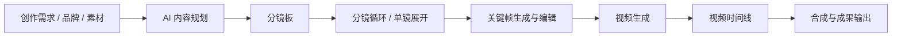

# FDM Creative 节点式图像视频工作台设计方案

- 路由：`/fdmcreative/workbench/`、`/fdmcreative/workbench/:projectId`
- 状态：已确认，进入一期实施
- 更新日期：2026-08-11

## 1. 方案结论

工作台采用“节点画布 + 分镜板 + 时间线”三视图、同一项目数据源的产品结构。

保留 FDM 现有 AntV X6 强类型 DAG、后端执行器、素材血缘、逻辑模型路由、权限和发布体系，不重做底层。参考项目只用于吸收交互与扩展模式：

- Storyboard-Copilot：借鉴无限画布、兼容节点快捷创建、分镜宫格编辑、结果派生和画布性能策略。
- Henji-AI：借鉴多供应商模型 Schema、类型化媒体端口、结构化提示词、结果占位、任务恢复和跨工作区资产复用。
- FDM：继续负责服务端密钥、可靠任务、并发配额、幂等、对象存储、权限、版本和完整 DAG 调度。

不复制参考项目的 Electron/Tauri、本地 SQLite、前端直连供应商、视觉素材或未确认许可的源码。

## 2. 产品定位

工作台不是单次图片或视频生成器，而是从创作需求到可交付视频的可追溯生产环境：

1. 输入创作需求、品牌约束与参考素材。
2. AI 生成内容规划并进入可编辑分镜板。
3. 按分镜批量或单镜生成关键帧。
4. 由关键帧生成视频片段，并保留每次尝试的素材版本。
5. 在独立时间线中安排片段、转场和后续音频。
6. 合成、保存到素材库或输出成品。

## 3. 页面信息架构

```text
┌ 返回 │ FDM Creative / 项目名 │ 画布·分镜板·时间线 │ 费用 │ 试运行 │ 发布 ┐
├──────────────┬──────────────────────────────┬──────────────────┤
│ 节点 / 模板   │                              │ 参数 / 结果 / 版本 │
│ 素材          │     无限画布、分镜板或时间线    │                  │
│              │                              │ 当前选中节点       │
│ 搜索、分类     │       AI 搭建工作流输入框       │ 校验与执行操作     │
├──────────────┴──────────────────────────────┴──────────────────┤
│ 运行队列：执行批次 → 循环轮次 → 节点任务 → 费用、进度、错误、重试      │
└───────────────────────────────────────────────────────────────┘
```

### 3.1 顶栏

- 返回项目中心、项目名称和编辑入口。
- 自动保存状态、草稿冲突提示、撤销与重做。
- `画布 / 分镜板 / 时间线`视图切换。
- 缩放、适应画布、自动布局。
- 预计费用、执行范围、试运行和发布。

### 3.2 左侧资源栏

- 节点：常用节点、高级节点、最近使用和收藏。
- 模板：商品视频、角色短片、批量海报等工作流模板。
- 素材：图片、视频和后续音频；支持搜索、分页和拖入画布。

### 3.3 中央工作区

- 画布：表达素材如何产生、处理和派生。
- 分镜板：表达镜头内容、顺序、连续性与采用版本。
- 时间线：表达素材何时播放；不得使用节点坐标或连线顺序推断播放顺序。
- 画布空白处双击或按快捷键打开节点命令面板。
- 从端口拖到空白处时只展示兼容节点，并自动创建和连线。

### 3.4 右侧检查器

固定检查器替代过大的锚定浮层，按节点类型显示：

- 基础参数。
- 素材与提示词。
- 模型和 Schema 参数。
- 运行结果。
- 版本历史与错误信息。

复杂能力如分镜和时间线打开大尺寸专用编辑区，节点卡片只保留摘要。

### 3.5 底部任务栏

- 按“执行 → 循环轮次 → 节点任务”分组。
- 显示阶段、真实状态、费用、错误、取消、重试和定位节点。
- 优先使用后端 SSE；断线后按事件游标补拉，轮询仅作为降级方案。

## 4. 核心创作流程



设计规则：

- AI 规划后先进入分镜板，不立即生成大量平铺分支。
- 每个 Shot 可以编辑、锁定、单独重跑或展开为节点组。
- 批量生产走分镜循环，精细调整时再展开单镜节点。
- 规划预览与付费模型运行保持分离；应用到画布不会自动执行。
- 图片和视频每次运行形成不可变素材版本。
- 时间线 Clip 引用明确的素材版本 ID；新版本是否替换由用户确认。

## 5. 节点体系

现有节点保留兼容，但节点库按主节点和高级节点重新组织。

| 类别 | 主节点 | 设计处理 |
| --- | --- | --- |
| 输入 | 创作需求、品牌资料、图片素材、视频素材 | 复用现有节点 |
| 规划 | AI 内容规划、分镜板 | 分镜板为新增核心节点 |
| 提示词 | 提示词、模板、LLM 生成器 | 随机、模板等进入高级区 |
| 图像 | 图片生成、图片编辑、图片处理 | 复用并统一节点外壳 |
| 视频 | 视频生成、视频处理 | 文生、图生、首尾帧使用统一视觉外壳 |
| 流程 | 分镜循环、集合、选择、批处理 | 复用运行前循环展开机制 |
| 输出 | 时间线、成果输出、保存素材库 | 时间线升级为真实编辑器 |
| 远期 | 配音、音乐、字幕 | 不进入一期 |

### 5.1 节点卡片

统一包含：

- 标题、类型、状态和预计费用。
- 图片或视频预览。
- 提示词摘要。
- 模型、比例、时长等关键徽标。
- 当前节点运行、运行下游和更多操作。
- 结果数量与当前采用版本。

节点使用缩放级别展示：

- 低于 60%：缩略图、标题和状态。
- 60% 至 100%：标准摘要。
- 高倍率或选中：显示更多摘要，完整编辑仍在右侧检查器。

### 5.2 类型与连线

- 继续使用强类型端口和 DAG 环路校验。
- 循环节点通过运行前展开实现，不允许真实回环连线。
- 媒体、模型和普通参数分别使用明确端口契约。
- UI 中显示人类可读的 `@角色正面`，持久化使用稳定素材 ID 和端口 ID。

## 6. 结果与版本

采用“节点内结果栈 + 可选固定到画布”的混合方式：

- 默认结果保存在生成节点的版本栈，如“结果 1/4”。
- 每个结果映射 `CreativeAsset + NodeRun`，保留素材血缘。
- “设为采用版本”决定下游默认输入。
- “固定到画布”才创建不可变结果节点，供分支比较或继续加工。
- 失败版本保留模型、参数、费用、错误和重试入口。
- 执行快照必须记录实际使用的素材版本，保证可复现。

## 7. 分镜数据

现有 `ContentPlanItem` 演进为 Shot，保留已有提示词、连续性、景别、运镜、时长、转场和参考素材字段，并逐步补充：

- 场次号、镜头号。
- 角色、场景和风格引用。
- 台词、旁白和动作。
- 审核状态与锁定状态。
- 当前采用的图片和视频素材版本。
- 单镜运行历史。

一次生成整张宫格再切分只作为快速草图工具，不能成为正式分镜的唯一真数据。

## 8. 时间线数据

`video-timeline` 当前只表达排序；真实时间线需要独立文档：

- `trackId`
- `assetVersionId`
- `startFrame`
- `durationFrames`
- `trimInFrames / trimOutFrames`
- `transition`
- `volume`
- 后续字幕、配音字段

画布负责“如何生成”，时间线负责“如何播放”。现有 FFmpeg 抽帧、裁剪、规格统一、转场和合成继续作为导出执行基础。

## 9. 技术方案

### 9.1 保留基础

- AntV X6 图适配器、序列化、缩略图、历史、拖放和快速兼容连线。
- 强类型端口、重复连线、自环、环路和节点数量校验。
- `FULL / NODE / DOWNSTREAM` 三种执行范围。
- FDM AI 逻辑模型、能力、参数 Schema、服务端供应商路由和用量记录。
- 项目成员、乐观锁草稿、不可变发布版本和素材血缘。

### 9.2 前端重构

- 将编辑器拆为 `WorkbenchTopbar`、`NodeLibrary`、`CanvasOverlays`、`PromptComposer`、`PlanReview`、`TaskPanel`。
- 将节点编辑器拆为素材、提示词、模型参数、节点参数、结果版本和底部动作模块。
- 将节点端口、视觉形态、编辑器类型、模型能力和默认配置收敛为声明式节点注册表。
- 用 Ant Design/Vben 语义 Token 替换硬编码浅色，支持浅色和 Studio 暗色主题。
- 模型 Schema 表单支持分组、顺序、条件显隐、输入数量限制与费用预估。

### 9.3 前后端协同

- 前端接入执行 SSE，并支持事件游标补拉。
- 项目响应增加当前成员角色或 `canEdit / canRun / canShare`。
- VIEWER 进入完整只读态；RUNNER 可运行但不可修改工作流。
- 版本接口补充版本详情、比较和恢复。
- 素材接口补充分页、重命名、标签、封面和血缘查询。
- 自动保存继续携带 `draftVersion`，冲突时不得静默覆盖。

## 10. 实施分期

### 一期：工作台外壳与可用性

- 拆分大型编辑器组件。
- 左侧三页签、固定右侧检查器、底部任务栏。
- 统一节点外观、主题适配和低倍率 LOD。
- 接入 SSE、只读权限和素材分页。
- 保留现有节点、执行器和草稿格式，不做破坏性迁移。

### 二期：分镜生产闭环

- 分镜板、Shot 数据、单镜重跑与批量循环。
- 结果版本栈、采用版本和固定到画布。
- 结构化素材引用。
- 工作流模板、分组、多选和自动布局。

### 三期：正式视频编排

- 多轨时间线、字幕、配音、音乐和预览播放器。
- 时间线版本和素材替换确认。
- 工作流版本详情、比较和恢复。
- 团队评论与审核状态。

## 11. 一期验收标准

- 现有图规则、专用单测和 E2E 不回退。
- 50 节点工作流拖动、缩放和选择保持流畅。
- 刷新后可恢复进行中的服务端任务。
- VIEWER 不可编辑；RUNNER、EDITOR 和 OWNER 操作符合权限。
- 错误节点可以从任务栏定位、查看原因并重试。
- 付费模型运行前可见费用或明确显示“待报价”。
- 浅色与暗色主题下节点、连线、面板和状态均可读。
- 保存冲突不会覆盖其他成员的新版本。

## 12. 参考项目

- [Storyboard-Copilot](https://github.com/henjicc/Storyboard-Copilot)
- [Henji-AI](https://github.com/henjicc/Henji-AI)

## 13. 一期第一批实施记录

2026-08-11 已完成：

- 项目中心由表格升级为故事板式响应式项目卡片，并保留搜索、筛选、分页、创建、编辑、删除和分享。
- 编辑器拆出顶部工具栏与节点库，形成“左节点库 + 中央 X6 画布 + 右侧固定检查器”的三栏结构。
- 项目响应增加当前用户角色；OWNER、EDITOR、RUNNER、VIEWER 已映射到编辑、运行、取消和只读画布行为。
- 执行状态接入带鉴权头的 fetch SSE，支持事件游标、补拉、去重、断线退避重连、Abort，并保留 15 秒降级轮询。
- 原任务抽屉替换为可折叠底部任务面板，显示实时连接状态、整体进度和节点运行状态。
- 工作台、节点、检查器、项目卡片和快捷连线浮层改用 Vben/Ant Design 语义主题 Token；X6 画布支持只读交互和主题背景。

本批次不伪造尚不存在的业务域。分镜板/Shot、结果采用版本、正式多轨时间线、音频字幕以及素材分页与血缘侧栏，继续按二期、三期实施。
