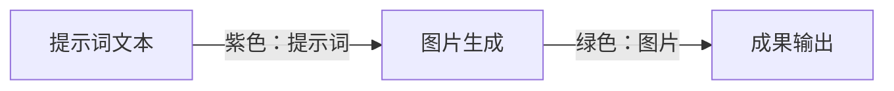
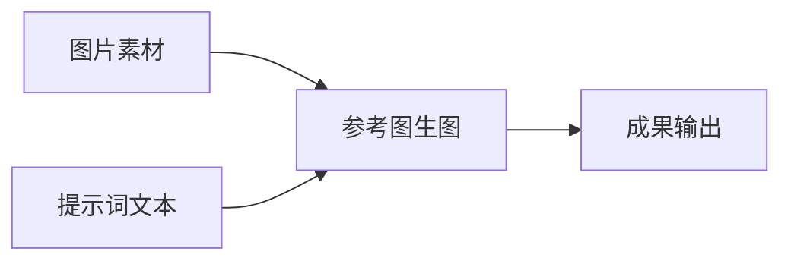
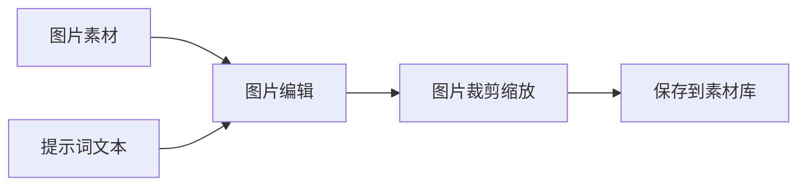
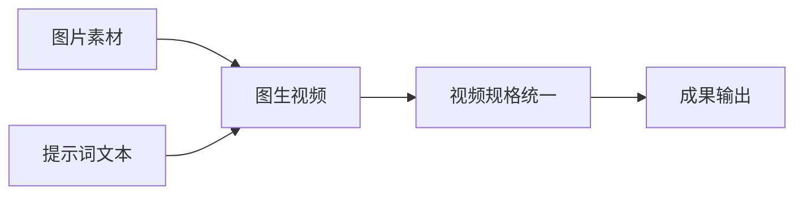
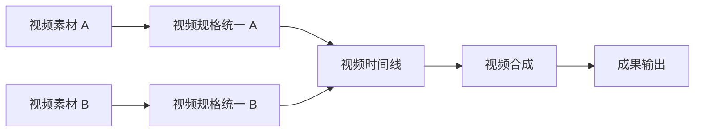

# FDM Creative 节点式图像视频工作台教程

本教程面向第一次使用 `/fdmcreative/workbench/14` 的用户。你不需要一次学会全部 32 个节点：先完成一个最小流程，再按需要查阅后面的节点说明。

> 项目编号 `14` 只是示例。日常使用请从“图像视频工作台”项目中心进入，并点击项目卡片上的“打开画布”。

## 1. 先认识界面

| 区域 | 作用 |
| --- | --- |
| 顶部工具栏 | 保存草稿、撤销/重做、缩放、适配画布、试运行和发布任务 |
| 左侧节点库 | 搜索节点；双击加入画布，或拖到画布指定位置 |
| 中央画布 | 摆放节点、连接输入输出，并查看节点状态 |
| 右侧节点设置 | 选择节点后配置素材、提示词、模型、比例、数量、时长和高级参数 |
| 底部运行队列 | 查看整次执行的进度、节点状态和错误 |
| 左上“查找节点” | 节点较多时按名称、类型或运行状态定位节点；快捷键为 `Ctrl/Cmd + F` |
| 左下缩略图 | 观察整个工作流的位置，并快速缩放或适配画布 |

左侧节点库中的每个节点都可以悬浮查看详细说明，包括用途、输入、输出、典型搭配和注意事项。使用键盘 `Tab` 聚焦节点时也会显示同样的说明。

## 2. 五分钟完成第一张图片

这是最容易理解的起步流程：

1. 在左侧搜索“提示词文本”，双击加入画布。
2. 再加入“图片生成”和“成果输出”。
3. 从“提示词文本”右侧圆点拖线，连接到“图片生成”左侧的提示词输入。
4. 从“图片生成”右侧绿色圆点拖线，连接到“成果输出”的图片输入。
5. 选中“提示词文本”，在右侧写：`一只白色陶瓷咖啡杯，柔和晨光，浅色桌面，商业产品摄影`。
6. 选中“图片生成”，选择可用的图片逻辑模型，设置比例和数量。
7. 点击右侧圆形运行按钮可以只运行当前节点；也可以点击顶部“试运行”执行整张画布。
8. 结果成功后会显示在节点设置中，并归档为项目素材。

如果“图片生成”没有可选模型，请先到“模型中心”启用具备图片生成能力的逻辑模型。工作台不会自动从供应商拉取并配置模型。

## 3. 节点和连线的基本规则

### 3.1 如何添加、编辑和删除

- 双击节点库条目：加入画布。
- 从节点库拖拽：加入画布指定位置。
- 单击画布节点：打开右侧设置。
- 拖动节点右侧输出圆点到空白处：只显示兼容的下游节点，选择后自动创建并连线。
- 选中节点或连线后按 `Delete` / `Backspace`：删除。
- `Ctrl/Cmd + Z`：撤销；`Ctrl/Cmd + Shift + Z`：重做。
- `Ctrl/Cmd + C`、`Ctrl/Cmd + V`：复制、粘贴所选内容。

### 3.2 连线颜色

| 颜色 | 数据类型 | 示例 |
| --- | --- | --- |
| 紫色 | 提示词文本 | 提示词文本 → 图片生成 |
| 绿色 | 图片或图片集合 | 图片素材 → 参考图生图 |
| 青绿色 | 视频、视频集合或时间线 | 视频素材 → 视频裁剪 |
| 蓝色 | 创作需求、内容规划、图片/视频方案 | AI 内容规划 → 视频片段 |
| 灰色 | 成果集合 | 成果集合 → 成果输出 |

连线只能从右侧输出连接到左侧输入。系统会阻止类型不匹配、重复连线、自环和会形成环路的连线。单张图片/视频可以接入对应的集合输入，但集合不能反向接入单素材输入；需要“图片选择”或“视频选择”先取出一个素材。

带必填输入的节点在未连接时不能执行。红色或高亮校验信息会显示在右侧节点设置中。

## 4. 推荐工作流

### 4.1 参考图生成新图片

“参考图生图”至少需要一张参考图。多张图片可以直接连接到它的图片集合输入。选中的模型还必须支持参考图或多参考图能力。

### 4.2 修改一张现有图片

“图片编辑”适合换背景、改局部内容或调整风格；“图片裁剪缩放”适合统一最终宽高和格式。

### 4.3 从图片生成视频

提示词应写清主体动作、镜头运动和场景变化。图生视频只要求首帧；“首尾帧视频”同时要求首帧和尾帧。

### 4.4 多片段合成视频

不同来源的视频建议先用“视频规格统一”设置相同宽高和帧率。视频时间线负责组织顺序，视频合成按输入顺序导出 MP4。

### 4.5 用 AI 自动拆分内容

1. 在画布底部输入完整创作需求。
2. 选择“图片 / 视频 / 混合”和数量，点击发送。
3. 在规划预览中逐项检查、修改提示词。
4. 点击“确认并应用到画布”。
5. 检查每个生成节点的模型、素材和参数，再执行。

应用规划只会创建或更新节点，不会自动调用付费图片或视频模型。

## 5. 全部节点说明

端口中的“必填”表示执行前必须连接，或在节点设置中选择对应的项目素材。

### 5.1 素材输入

| 节点 | 用途 | 输入 | 输出 | 使用提示 |
| --- | --- | --- | --- | --- |
| 创作需求 | 保存创作目标、受众、风格和总体约束 | 无 | 创作需求 | 连接 AI 内容规划、提示词模板或提示词生成器 |
| 图片素材 | 选择或上传一张项目图片 | 无 | 单张图片 | 常接参考图生图、图片编辑、图生视频；图片最大 25 MB |
| 视频素材 | 选择或上传一个项目视频 | 无 | 单个视频 | 常接裁剪、抽帧、规格统一、转场；视频最大 500 MB |
| 品牌 / 商品资料 | 保存品牌规范、商品卖点和不可改变的约束 | 无 | 创作需求 | 适合作为规划或提示词生成的上下文 |

素材必须先上传到项目素材库。不要在节点配置中粘贴本地文件路径、Base64、`blob:` / `data:` 地址、凭证或临时签名地址。

### 5.2 提示词与 LLM

| 节点 | 用途 | 输入 | 输出 | 使用提示 |
| --- | --- | --- | --- | --- |
| 提示词文本 | 保存一段固定、可复用的提示词 | 无 | 提示词 | 最适合新手；可同时连接多个生成节点，内容不能为空 |
| 随机提示词 | 每次执行从多行候选或上游提示词中随机选一条 | 可选：提示词 | 提示词 | 每行一个候选；至少需要一个候选，重复内容会去重 |
| 提示词模板 | 本地组合上游提示词与创作需求，不调用模型 | 可选：提示词、创作需求 | 提示词 | 支持 `{{input}}`、`{{context}}`、`{{brief}}` |
| 提示词生成器 | 使用文字模型把需求、上下文和参考图改写成专业提示词 | 可选：创作需求、提示词、图片集合 | 提示词 | 模型需要 `TEXT + CHAT`；使用参考图时还需 `IMAGE_INPUT` |

生成节点连接了上游提示词后，运行时优先使用上游输出；节点内本地提示词只是未连接时的备用值。提示词中的 `@图片1` 等引用必须能对应当前已连接或已选择的参考图。

### 5.3 流程控制与批处理

| 节点 | 用途 | 输入 | 输出 | 使用提示 |
| --- | --- | --- | --- | --- |
| 图片循环 | 按轮次切换变化提示词和图片，串行重复整个下游分支 | 可选：提示词、创作需求、图片集合 | 轮次提示词、所选图片集合 | 1～20 轮；支持 `{{item}}`、`{{index}}`、`{{total}}` 等变量 |
| 视频循环 | 按轮次切换变化提示词和视频，串行重复整个下游分支 | 可选：提示词、创作需求、视频集合 | 轮次提示词、所选视频集合 | 每一轮完成后才进入下一轮，适合批量变体，不是画布回环 |
| 图片选择 | 从图片集合取首张、末张或指定序号 | 必填：图片集合 | 单张图片 | 用于把集合转换成单图，序号从 1 开始 |
| 视频选择 | 从视频集合取首个、末个或指定序号 | 必填：视频集合 | 单个视频 | 常接视频裁剪、抽帧或转场 |

循环次数和下游生成数量会共同放大模型调用次数与费用。先用 1～2 轮试运行，再扩大批次。

### 5.4 AI 规划

| 节点 | 用途 | 输入 | 输出 | 使用提示 |
| --- | --- | --- | --- | --- |
| AI 内容规划 | 把总体需求拆成图片、视频或混合内容项 | 可选：创作需求 | 内容规划 | 模型需要 `TEXT + STRUCTURED_OUTPUT`；有参考图时还需 `IMAGE_INPUT` |
| 图片方案 | 表达一张图的构图、光线、比例、数量与提示词 | 必填：内容规划 | 图片方案 | 通常由规划预览自动生成，不必手工创建 |
| 视频片段 | 表达一个片段的动作、运镜、景别、时长与提示词 | 必填：内容规划 | 视频方案 | 常接视频生成、图生视频或首尾帧视频 |

### 5.5 图像生成与处理

| 节点 | 用途 | 输入 | 输出 | 使用提示 |
| --- | --- | --- | --- | --- |
| 图片生成 | 文生图，也可带方案或参考图 | 可选：图片方案、提示词、图片集合 | 单张或多张图片 | 选择图片逻辑模型，设置比例、数量和负向提示词 |
| 参考图生图 | 使用一张或多张参考图生成新图片 | 必填：图片集合；可选：图片方案、提示词 | 图片 | 模型必须支持参考图；多图时需要多参考能力 |
| 图片编辑 | 按提示词修改一张输入图片 | 必填：单张图片；可选：提示词 | 图片 | 适合局部修改或风格调整；不是纯文生图节点 |
| 图片裁剪缩放 | 本地裁剪、缩放并转换 PNG/JPEG | 必填：单张图片 | 图片 | `FIT` 保留完整内容，`FILL` 铺满并裁切，`STRETCH` 直接拉伸 |

### 5.6 视频生成与处理

| 节点 | 用途 | 输入 | 输出 | 使用提示 |
| --- | --- | --- | --- | --- |
| 视频生成 | 根据提示词或视频方案生成视频 | 可选：视频方案、提示词 | 视频 | 设置比例、时长、分辨率、运镜和播放速度 |
| 图生视频 | 以图片为首帧或视觉参考生成视频 | 必填：首帧；可选：视频方案、提示词 | 视频 | 没有连线的图片不会被隐式使用 |
| 首尾帧视频 | 用首帧和尾帧共同约束视频 | 必填：首帧、尾帧；可选：视频方案、提示词 | 视频 | 选择明确支持首尾帧能力的模型 |
| 视频裁剪 | 从指定开始时间截取指定时长 | 必填：单个视频 | 视频 | 开始时间不能超过源视频；时长必须大于 0 |
| 视频抽帧 | 抽取首帧、尾帧或指定时间的图片 | 必填：单个视频 | 图片 | 常用于从已有视频提取图生视频首帧 |
| 视频规格统一 | 统一尺寸、帧率、像素格式和音频编码 | 必填：单个视频 | 视频 | 多片段合成前建议都经过此节点 |
| 视频转场 | 为两个视频片段添加基础转场 | 必填：第一片段、第二片段 | 视频 | 可设置淡化、叠化、擦除、闪白、开始时间和时长 |
| 视频合成 | 按输入顺序拼接并导出 MP4 | 必填：视频集合 | 视频、时间线 | 上游规格不一致时先统一；顺序由输入和上游时间线决定 |

### 5.7 聚合与输出

| 节点 | 用途 | 输入 | 输出 | 使用提示 |
| --- | --- | --- | --- | --- |
| 图片集合 | 把多张图片整理为有序集合 | 必填：图片或图片集合 | 有序图片集合 | 一张图片也可直接连入集合端口 |
| 视频时间线 | 按输入顺序组织视频片段 | 必填：视频或视频集合 | 有序视频集合、时间线 | 当前是顺序型时间线，不是多轨剪辑器 |
| 成果集合 | 聚合图片、视频和时间线 | 可选：图片、图片集合、视频、视频集合、时间线 | 成果集合 | 用于把多类结果汇总到单一输出节点 |
| 成果输出 | 汇总并保留最终图片、视频或时间线 | 至少连接一个成果输入 | 无 | 适合最终结果验收；节点结果区可打开已归档的素材链接，它不会自动下载或发布工作流 |
| 保存到素材库 | 把最终成果提升为 FDM 私有素材 | 至少连接一个成果输入 | 无 | 适合需要跨工作流复用的正式成果 |

## 6. 保存、试运行和发布的区别

| 操作 | 做什么 | 不会做什么 |
| --- | --- | --- |
| 保存草稿 | 保存当前节点、连线、位置和配置 | 不调用模型，不生成不可变版本 |
| 试运行 | 执行整张画布；有未保存修改时会先保存 | 不等于发布 |
| 运行当前节点 | 执行所选节点；系统仍会补齐它需要的上游前置节点 | 不是脱离依赖的孤立调用 |
| 从此向下运行 | 从所选节点开始执行下游范围，并补齐必要上游 | 不执行无关分支 |
| 发布任务 | 把当前草稿发布为不可变版本 | 不会自动开始模型执行 |

顶部保存状态可以点击。当前工作台没有自动保存；出现“有未保存修改”时，应在离开页面前主动保存。若提示草稿已在其他页面更新，请刷新后合并或重做，不要覆盖其他成员的新版本。

## 7. 角色权限

| 角色 | 编辑 | 运行 | 分享成员 |
| --- | --- | --- | --- |
| OWNER | 可以 | 可以 | 可以 |
| EDITOR | 可以 | 可以 | 不可以 |
| RUNNER | 不可以 | 可以 | 不可以 |
| VIEWER | 不可以 | 不可以 | 不可以 |

只读用户仍可缩放、查找节点、选择节点并查看配置与结果。

## 8. 常见错误排查

### 8.1 节点无法连接或无法运行

1. 检查连线是否从输出到输入。
2. 检查两端颜色和数据类型是否兼容。
3. 检查必填端口是否已连接或已选择项目素材。
4. 检查是否产生环路或重复连线。
5. 选中失败节点，查看右侧红色错误信息。

### 8.2 没有可选模型

- 到模型中心确认逻辑模型已启用。
- 确认模型模态为 TEXT、IMAGE 或 VIDEO，且与节点匹配。
- 内容规划需要 `STRUCTURED_OUTPUT`；提示词生成器需要 `CHAT`。
- 参考图输入需要 `IMAGE_INPUT`，多参考图还需要相应能力。

### 8.3 `PROVIDER_HTTP_404`

这通常表示供应商适配器、Base URL、接口路径或路由中的供应商模型 ID 不匹配，不是 `/fdmai/usage` 页面本身返回 404。到模型中心核对供应商账号、适配器、路由和真实 API 契约。

### 8.4 `SUBMISSION_UNKNOWN` / `RECOVERY_SUBMISSION_UNKNOWN`

这表示系统无法确认供应商是否已接收请求。不要连续或批量重试：旧请求可能已经生成并计费。先到 FDM AI 调用记录和供应商后台核对任务，再决定是否重新执行。

### 8.5 其他服务商错误

- `401 / 403`：检查 API Key、账号权限和租户配置。
- `429`：检查并发、余额、配额与限流。
- `5xx`：供应商或网关异常；对于已发送的生成请求，先确认是否已被受理再重试。
- 结果归档失败：检查文件服务、对象存储和可访问的输出 URL。

## 9. 新手使用建议

1. 先使用 3 个节点的最小流程，不要一开始搭建完整视频链路。
2. 先运行单个节点，确认模型和素材正确，再运行下游或整图。
3. 图片数量、循环轮次和下游分支会乘法放大调用次数，应小批量验证。
4. 多视频合成前先统一规格。
5. 参考图名称清晰、主体一致，有助于正确使用 `@图片1` 等引用。
6. 画布变大后用 `Ctrl/Cmd + F`、状态筛选、缩略图和“适配画布”，不要靠滚动逐个寻找。
7. 发布和运行是两个独立动作：先保存和验证，再发布稳定版本。

## 10. 当前功能边界

当前已经提供强类型节点画布、AI 规划预览、图片/视频生成与处理、顺序时间线、成果归档和可靠任务执行。正式分镜板、素材结果版本栈以及多轨视频/音频/字幕时间线仍属于后续规划，本文不会把它们当成已经上线的功能。
